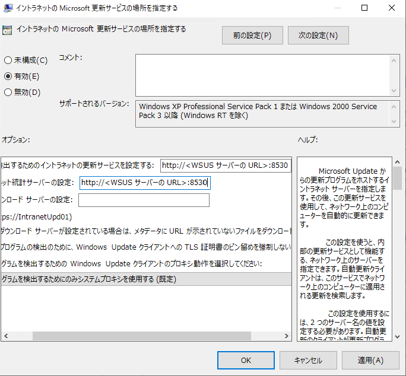
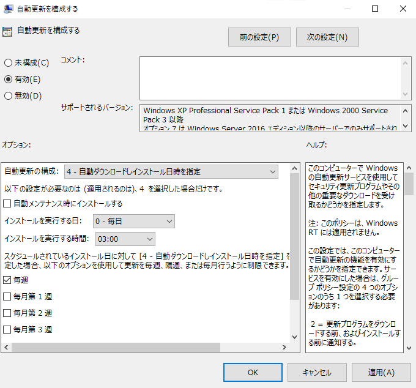

# WSUS クライアントのグループ ポリシー : その 1 – 基本編

こんにちは。WSUS サポートチームです。

今回は、WSUS をご利用いただく環境において、クライアントに対し必須構成となる下記の 2 つのグループ ポリシーについてご紹介します。WSUS クライアントのグループ ポリシーを構成する際に、参考にしてみてください。

1. [イントラネットの Microsoft 更新サービスの場所を指定する]
2. [自動更新を構成する]

※ 今回ご案内する WSUS や Windows Update に関連するポリシーは、グループ ポリシー エディターの [コンピューターの構成] – [管理用テンプレート] – [Windows コンポーネント] – [Windows Update] 配下に配置されています。

なお、Windows 8 / Windows Server 2012 以降の OS にてグループ ポリシーを設定する場合の注意点につきまして、下記の記事にて紹介しております。Windows 8 / Windows Server 2012 以降の OS にてグループ ポリシーを設定される場合には、併せて下記の記事も参照してください。

Title : WSUS クライアントのグループ ポリシー : その 2 – Windows 8 / Windows Server 2012 以降編  
URL : https://jpmem.github.io/blog/wsus/2015-03-24_01/  

## 1. [イントラネットの Microsoft 更新サービスの場所を指定する]

設定例 : WSUS サーバーから更新プログラムの配信を行う場合
——————————————————————————————  
◆ 設定値 : [有効]  
◆ オプション :  
 – 更新を検出するためのイントラネットの更新サービスを設定する : [<WSUS サーバーの URL>] ※  
 – イントラネット統計サーバーの設定 : [<WSUS サーバーの URL>] ※  
——————————————————————————————  
※ 本グループ ポリシーで指定する 2 つの URL は、必ず同一に設定する必要があります。

※ Windows Server 2012 以降の WSUS では、既定で利用されるポート番号が 80、443 から 8530、8531 に変更されています。URL を指定する際はポート番号も併せて指定してください。

[ポリシーの説明]  
このグループ ポリシーを有効にすることで、クライアントが接続を行うサーバーを Windows Update / Microsoft Update のサーバーから、WSUS サーバーへ変更出来ます。

このため、WSUS サーバーをご利用いただく際には、必ずこのグループ ポリシーを “有効” に設定し、オプションの 2 箇所共に同じ WSUS サーバーの URL を指定してください。

## 2. [自動更新を構成する]

設定例 : 新たな更新プログラムの配信された場合は、自動ダウンロードしインストールを 3:00 に自動実行する場合  
——————————————————————————————  
◆ 設定値 : [有効]  
◆ オプション :  
 – 自動更新の構成 : [4 – 自動ダウンロードしインストール日時を指定]  
 – 自動メンテナンス時にインストールする : [無効] ※  
 – インストールを実行する日 : [0 – 毎日]  
 – インストールを実行する時間 : [03:00]  
——————————————————————————————  
※ Windows 7 / Windows Server 2008 R2 以前の環境ではこの設定はありません。詳細は「WSUS をご利用いただく上で、よくご設定いただくグループ ポリシー : その 2 – Windows 8 / Windows Server 2012 以降編」を参照ください。

[ポリシーの説明]  
このグループ ポリシーは、WSUS を利用する上で必須の設定ではありませんが、有効にすることで、更新プログラムのインストール処理を、自動実行することが出来る非常に便利なグループ ポリシーです。是非併せて設定いただくことをご検討ください。

また、このグループ ポリシーのオプションにて、具体的に更新プログラムのインストール処理を「どの処理まで」自動的に実行させるかも、細かく制御することが出来ます。

上述のオプションによって、Windows Update の動作がどのように制御出来るのか、正しく理解するために、まずは手動で Windows Update が実行された際にクライアント内でどのような処理が行われるのか、以下に説明します。

### Windows Update の処理の実行順序

Windows Update が手動で実行されると、クライアント内にて、下記の順番に処理が行われます。

A. 更新プログラムの検出  
⇒ クライアントに新たに適用が必要な更新プログラムがあるかどうかの確認処理

B. 更新プログラムのダウンロード  
⇒ 「A」にて検出された更新プログラムのダウンロード処理

C. 更新プログラムのインストール  
⇒ 「B」にてダウンロードされた更新プログラムのインストール処理

なお、上記の順番は、WSUS の設定に関係なく、Windows Update / Microsoft Update サイトに対して更新プログラムの確認を行うよう設定していても、同様の順番に処理されます。

### “自動更新の構成” オプションの設定

上記の動作を踏まえ、実際に “自動更新の構成” にて、どのように Windows Update の動作を制御出来るのかご説明します。“自動更新の構成” では、上述の A ～ C の「どの処理まで」自動的に実行するのか設定することが出来ます。具体的には、各設定を行うと下記のように Windows Update の動作が自動実行されます。

[2 – ダウンロードとインストールを通知] :  
⇒ A の処理は自動実行、B 以降の処理は手動実行

・ [3 – 自動ダウンロードとインストールを通知]  
⇒ B までの処理は自動実行、C 以降の処理は手動実行

・ [4 – 自動ダウンロードしインストール日時を指定]  
⇒ A ～ C すべての処理を自動実行、C の処理は指定した日時に実行し、再起動を実行

・ [5 – ローカルの管理者の設定選択を許可]  
⇒ クライアントのコントロール パネルにて、それぞれ設定することを許可

例えば、「ユーザーに操作させることなく Windows Update を自動実行したい」場合には、上記の [4] 番の設定を行うと、指定した日時に Windows Update のすべての処理が自動実行されます。逆に「ユーザーが意図しないタイミングで、Windows Update の処理が自動実行されたら困る」場合には、このグループ ポリシー自体を無効に設定すると、A ～ C の処理いずれも自動実行されないようになります。

このように環境に併せて、細かく Windows Update の制御が出来るグループ ポリシーですので、ぜひ積極的にご活用ください。

<補足 : クライアントがドメインに参加していない場合>  
もちろん、ドメインに参加していないクライアントでも、ローカル グループ ポリシーやグループ ポリシーに対応するレジストリ値を変更することで、同様に WSUS をご利用いただけますので、是非ご参考にしてください。

なお、グループポリシーの各項目とレジストリの値の対応関係につきましては、英語情報のみにて恐縮ですが、以下の公開情報がございますのでご紹介します。

WSUS 3.0 SP2 の展開ガイド  
” Configure Clients in a Non-Active Directory Environment”  
http://technet.microsoft.com/ja-jp/library/dd939844(v=ws.10).aspx  
なお、下記の日本語版はすでにサポートを終了した前製品：WSUS 2.0 の情報ですが、多くの部分は WSUS 3.0 SP2 にも該当しますので、ご参考までに付記します。

WSUS 2.0 の展開ガイド  
“Active Directory 以外の環境で自動更新を構成する”  
http://technet.microsoft.com/ja-jp/library/cc708449(v=ws.10).aspx
