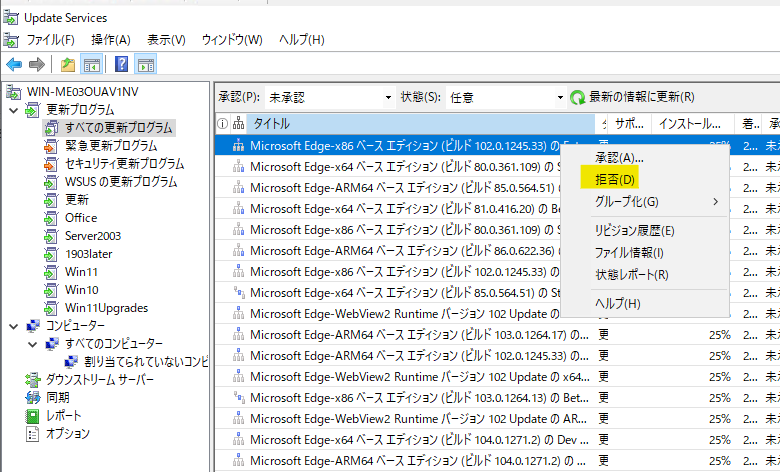
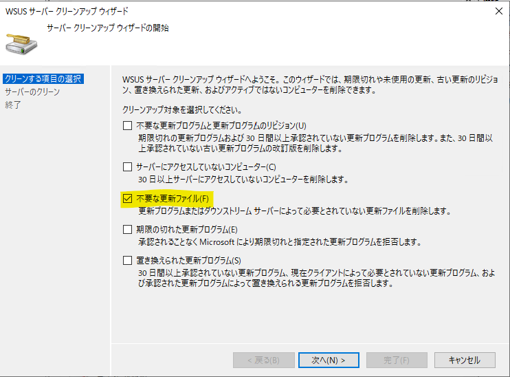

# WSUS のサーバー クリーンアップ ウィザードで不要な更新プログラムのコンテンツ ファイルを削除する
みなさま、こんにちは。WSUS サポート チームです。  

WSUS サーバーを長期間運用している、または自動承認規則で製品などにフィルターをかけずに運用していると、知らない間に更新プログラムのコンテンツ ファイルが多くダウンロードされており、「ディスク サイズの空き容量がない！」といったトラブルが発生することがあります。  
WSUS は自動でメンテナンスを行う機能を持っておりませんので、ディスク サイズの空き容量が少なくなった場合は、「サーバー クリーンアップ ウィザード」を実行して、不要なファイルを削除する必要があります。  
でも、「サーバー クリーンアップ ウィザードを実行しても、あまり不要なファイルが削除されない！空き容量が増えない！」という結果になったことはありませんしょうか。  

そこで今回は、WSUS で不要な更新プログラムのコンテンツ ファイルを確実に削除するためのポイントについてご紹介いたします。  

- 「サーバー クリーンアップ ウィザード」で WSUS で不要な更新プログラムのコンテンツ ファイルを削除する
- 「サーバー クリーンアップ ウィザード」実行後も更新プログラムのコンテンツ ファイルが削除できない場合  

# 「サーバー クリーンアップ ウィザード」で WSUS で不要な更新プログラムのコンテンツ ファイルを削除する

サーバー クリーンアップ ウィザード項目で **「不要な更新ファイル」** を実行することで、不要な更新ファイルを削除することができますが、削除対象となる更新プログラムは **「拒否済み」のステータスとなっている必要があります。**  
そのため、以下の流れで不要な更新プログラムのコンテンツ ファイルを削除します。  

(作業の流れ)  
STEP1 : 更新プログラムを「拒否済み」とする  
  
STEP2 : サーバー クリーンアップ ウィザードで「不要な更新ファイル」を実行する  


# 「サーバー クリーンアップ ウィザード」実行後も更新プログラムのコンテンツ ファイルが削除できない場合  

上記流れで「サーバー クリーンアップ ウィザード」を実行した場合でも、更新プログラムのコンテンツ ファイルが削除できないことがあります。代表的な要因は以下の通りです。  

## 要因 1 : WSUS オプション設定が既定から変更されている 
既定では、下図のとおりWSUS オプションの「更新ファイルと更新言語」の「更新プログラムが承認されている場合にのみ、更新ファイルをこのサーバーにダウンロードします」のチェックが「オン」です。この設定が「オフ」の構成の場合には、このままクリーンアップを実行しても「拒否済み」の更新プログラムのコンテンツ ファイルを削除することは出来ません。このような構成の場合には、既定の「オン」に変更し、クリーンアップウィザード実施後に、再度「オフ」に戻します。 

  

## 要因 2 : 「拒否済み」とした更新プログラムのコンテンツ ファイルが他の更新プログラムで利用されており、かつ、インストール承認を行っている  
例として、以下の更新プログラムは、同一のコンテンツ ファイルを利用しています。このような更新プログラムは、一方を「拒否済み」としても、もう一方で「インストール承認」済みの場合には、更新プログラムのコンテンツ ファイルを削除することが出来ません。  

Windows 7 for x64-based Systems 用の更新プログラム (KB974431)  
Windows Server 2008 R2 x64 Edition 用の更新プログラム (KB974431)  

見分け方としては、WSUS 管理コンソールで承認ステータスが「拒否済み」でも、[ファイルの状態] 列ではインストール承認ステータスのままとなります。  

## 要因 3 : 子 WSUS が「自律」の構成である もしくは 過去に「自律」の 子 WSUS が存在していた
親子 WSUS 構成で、子 WSUS が「自律」の場合、子 WSUS 側では親 WSUS とは異なる承認情報を保持できます。  
たとえば、親 WSUS 側では未承認の更新プログラムも、子 WSUS が必要とすれば、親 WSUS は Microsoft Update カタログから更新プログラムのダウンロードを行います。この場合　**「この更新プログラムは子 WSUS の要求によりダウンロードしたものである」ことを示すフラグ**　を、データベース内のファイル情報に対して設定します。  

このフラグが設定されたファイルは、親 WSUS 側でサーバー クリーン アップウィザードを実行しても削除されないよう設計されています。過去に、子 WSUS が存在し、現在はすでに登録解除を行っている場合でも、この状態は変化いたしません。  
そのため、サーバー クリーンアップ ウィザードでこのフラグが設定された不要な更新プログラムのコンテンツ ファイルを削除できるようにするためには、以下の手順でデータベースに対して SQL を発行し、フラグを解除する作業が必要になります。  

### 手順
**(※ 重要) データベース内の情報を変更する操作となりますので、必ず事前に WSUS データベースのバックアップをご実施ください。**  

Title : WSUS データベースのバックアップ方法について
URL : https://jpmem.github.io/memlog/wsus/backup/backup.html

子 WSUS によって必要とされている更新プログラムの有無の確認は、親 WSUS 管理コンソールから目視で確認をすることができません。そのため、以下の手順にて、フラグが設定されている更新プログラムが存在するかを確認します。WSUS のデータベース (SUSDB) への接続手順は SQL Server か Windows Internal Database (WID) かで異なります。接続方法につきましては、以下の公開情報をご確認ください。

Title : WSUS データベース (SUSDB) への SQL Query 実行結果の出力方法について
URL : https://jpmem.github.io/memlog/wsus/sql/sqlquery.html

1. SQL Server Management Studio を起動し、WSUS のデータベースを実行しているデータベース エンジンに接続します。  
2. Microsoft SQL Server Management Studio 画面が起動したら、画面左ペインの[データベース] ツリーを展開します。  
3. [SUSDB] を右クリックし [新しいクエリ] をクリックします。  
4. 右ペインに表示された新しいクエリ画面に、以下のとおり入力し、ツールバーの [実行] をクリックするかもしくは F5 キーを押して、実行を開始します。  

```
SELECT COUNT(DSSRequestedDownload) FROM dbo.tbFileOnServer WHERE DSSRequestedDownload = 1
```

この結果、2 行目に表示される数値が 0 以外であれば、フラグの設定を持つ更新プログラムのが存在しています。  
その場合は引き続き下記の手順をご実施します。  

5. 引き続き下記 2 件のコマンドを順に実行します。  

```
update tbfileOnServer set actualstate=1 where (actualstate=8 or actualstate=9 or actualstate=10) and 　　DSSRequestedDownload = 1
update tbFileOnServer set DSSRequestedDownload = 0 WHERE DSSRequestedDownload = 1
```

6. 正しく変更されたかの確認のために、下記コマンドを実行します。  

```
SELECT COUNT(DSSRequestedDownload) FROM dbo.tbFileOnServer WHERE DSSRequestedDownload = 1
```

結果が 0 なら正しく変更されています。  

### 補足
通常の用途で WSUS を利用している場合には WSUSContent フォルダにのみファイルがダウンロードされますが、[Local Publishing](https://learn.microsoft.com/en-us/previous-versions/windows/desktop/bb902470(v=vs.85)) とよばれる特殊な機能を利用し、任意のアプリケーションやアプリケーションの更新の配信を行っている場合には、UpdateServicesPackages フォルダにもファイルが保存され、これらのファイルはクリーンアップ ウィザードでは削除することが出来ません。  

UpdateServicesPackages フォルダ配下のファイルの削除が必要な場合には、以下の手順を実施し、出力されたフォルダについて手動で削除する必要があります。  

1. WSUS サーバー上で以下のコマンドを実行します。  
```
"C:\Program Files\Update Services\Tools\WsusUtil" listunreferencedpackagefolders
```

結果出力例)  
```
次のフォルダーは、WSUS サーバーの更新プログラムのいずれからも参照されていません。  
C:\WSUS\UpdateServicesPackages\test  
```

2. 上記のコマンドの実行結果にて出力された参照されていないフォルダーについて削除を行います。  