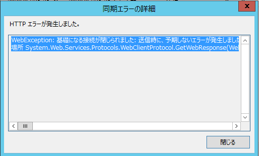

# WSUS (Windows Server 2012/Windows Server 2012 R2) の同期処理が失敗する事象について

(この記事は、弊社サポートメンバーがフォーラムへ投稿した内容をブログ向けに編集したものです)

皆様、こんにちは。WSUS サポート チームです。

本記事では、Windows Server 2012 または Windows Server 2012 R2 の WSUS サーバーの同期処理が失敗する事象についてご案内いたします。

2020 年 07 月以降で同期処理が下記のエラー内容で失敗する、というお問い合わせを多く頂いております。

```
WebException: 基礎になる接続が閉じられました: 送信時に、予期しないエラーが発生しました。 ---> System.IO.IOException: 転送接続からデータを読み取れません: 既存の接続はリモート ホストに強制的に切断されました。。
```



## 事象
Windows Server 2012 / Windows Server 2012 R2 の WSUS サーバーで同期処理が上記エラー内容で失敗する。

稀に成功することがあるが、ほとんどの場合で手動/自動にかかわらず失敗する。

## 原因
調査の結果、本事象が報告されている WSUS サーバーはすべて TLS 1.0 で弊社サイトと通信しており、
弊社サイトにて TLS 1.0 の通信が許可されていないことにより、
TLS ネゴシエーションが正常に行われず同期処理も失敗する動作となります。

## 対処方法
TLS 1.2 を用いて通信するように構成いただくことにより改善します。

下記の公開情報に記載されているように、Windows Server 2012 / Windows Server 2012 R2 の WSUS サーバー
にそれぞれ下記のロールアップを適用することにより、TLS 1.2 通信させることが可能ですので、対象のロールアップ
をご適用ください。

[Windows Server Update Services (WSUS) を更新する](https://learn.microsoft.com/ja-jp/mem/configmgr/core/plan-design/security/enable-tls-1-2-server#bkmk_wsus)

(該当箇所抜粋)

---

以前のバージョンの WSUS で TLS 1.2 をサポートするには、WSUS サーバーに次の更新プログラムをインストールします。

- Windows Server 2012を実行している WSUS サーバーの場合は、更新プログラムの4022721以降のロールアップ更新プログラムをインストールします。
- R2 Windows Server 2012実行している WSUS サーバーの場合は、更新プログラム 4022720以降のロールアップ更新プログラムをインストールします。

Windows Server 2016以降、WSUS では TLS 1.2 が既定でサポートされています。 TLS 1.2 更新プログラムは、Windows Server 2012および R2 WSUS サーバー Windows Server 2012でのみ必要です。

---

### 注意事項

WSUS サーバーのポート番号を既定の 8530/8531 番から 80 番に変更いただいている環境ではロールアップ更新プログラムの適用の注意事項として下記ブログにてご紹介している事象がございますのでご注意ください。

[Windows Server 2012 / 2012 R2 の WSUS へロールアップ を適用するとクライアントからの接続が失敗する事象について](https://jpmem.github.io/blog/mecm/20200729_01/)
