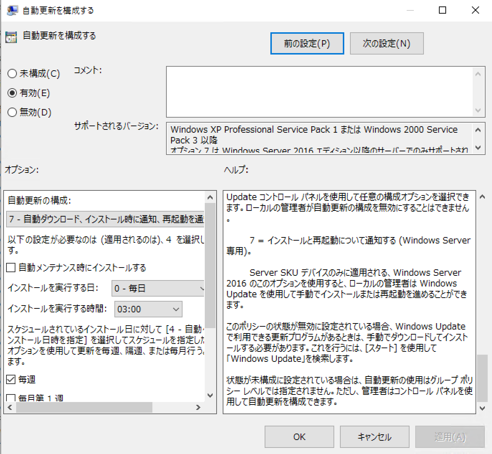
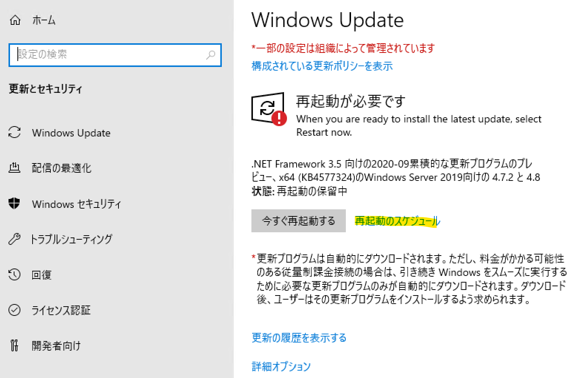

# 新しい自動更新のオプション「7 - 自動ダウンロード、インストール時に通知、再起動を通知」について

皆様こんにちは。WSUS サポート チームです。

今回は Windows Server 2016 / 2019 にて提供された新しい自動更新のオプション「7 - 自動ダウンロード、インストール時に通知、再起動を通知」について紹介いたします。

この新しい自動更新のオプションは、以下の累積更新プログラムを適用したビルド以降で使用可能となります。

- Windows Server 2016  
Title : 2020 年 1 月 24 日 - KB4534307 (OS ビルド 14393.3474)  
URL : https://support.microsoft.com/ja-jp/topic/2020-%E5%B9%B4-1-%E6%9C%88-24-%E6%97%A5-kb4534307-os-%E3%83%93%E3%83%AB%E3%83%89-14393-3474-b181594e-2c6a-14ea-e75b-678efea9d27e

- Windows Server 2019  
Title : 2020 年 1 月 23 日 - KB4534321 (OS ビルド 17763.1012)  
URL : https://support.microsoft.com/ja-jp/topic/2020-%E5%B9%B4-1-%E6%9C%88-23-%E6%97%A5-kb4534321-os-%E3%83%93%E3%83%AB%E3%83%89-17763-1012-023e84c3-f9aa-3b55-8aff-d512911c459f

  

従来の Windows Server 2016/2019 の自動再起動の制御方法につきましては、以下の公開情報にて記載した制御方法しかありませんでしたが、上記ビルド以降であれば、この新しい自動更新のオプション 7 を使用することで、更新プログラムのインストール、再起動をユーザー手動にすることができます。  

Title : Windows 10 / Windows Server 2016 の Windows Update 後の自動再起動の制御方法  
URL : https://social.msdn.microsoft.com/Forums/ja-JP/52afc78a-30c0-4c2d-a9d7-2751f314bd57/windows-10-windows-server-2016-12398-windows-update?forum=jpsccmwsus  

こちらの自動更新のオプション 7 を使用すれば、「再起動待ち」の状態になったとしても、アクティブ時間外であってもユーザーが手動で再起動しない限り自動再起動されることはありません。
ただし、[再起動のスケジュール] をクリックして再起動をスケジュールした場合は、指定した日時で自動再起動されますのでご注意ください。

  

また、本オプションは Windows 10 では提供されておらず、Server のみ提供されたオプションとなりますので、Windows 10 の自動再起動の制御方は従来通り「Windows 10 / Windows Server 2016 の Windows Update 後の自動再起動の制御方法」をご参照ください。
