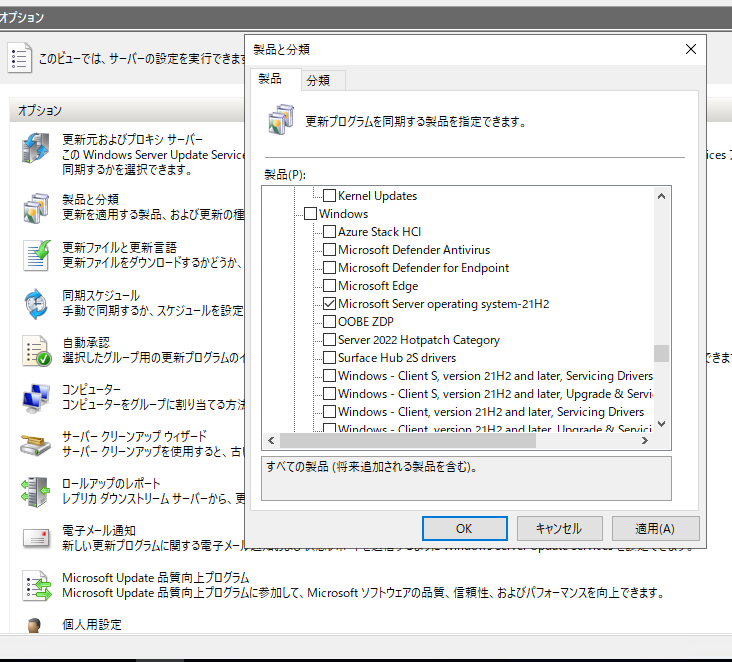
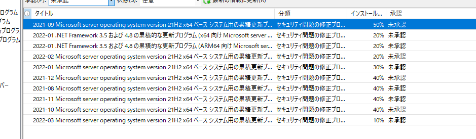

# Windows Server 2022 に更新プログラムを配布するためのポイント

みなさま、こんにちは。WSUS サポート チームです。

近頃のお問い合わせで、「 WSUS から Windows Server 2022 へ更新プログラムを配信することはできますか 」との声をよくいただくようになりました。  
そこで、今回は 2021年9月1日（米国時間）リリースされた Windows Server 2022 に WSUS または Configuration Manager を利用して更新プログラムを配布する為のポイントをご紹介します。  

Windows Server 2022 向けの更新プログラムを WSUSへ 同期するためには、同期対象に以下の "製品" を追加する必要があります。

**製品「Microsoft Server operating system-21H2」**

～～～ WSUS をご利用の場合～～～
ー同期対象追加手順ー  
１．WSUSコンソールを開きます。  
２．[オプション]>[製品と分類]>"製品" を開きます。  
 Windows配下の製品項目「Microsoft Server operating system-21H2」にチェックを入れてOKを押します。  
 （※取得したい更新プログラムに応じて "分類" 項目の追加も実施ください）

３．その後、WSUSで同期を実施いただくことで、Windows Server 2022 向けの更新プログラムを取得することができます。  

～～～Configuration Manager をご利用の場合～～～
Configuration Manager をご利用の場合には、Configuration Manager コンソールより以下ソフトウェア更新ポイントの同期対象の設定箇所から追加いただけます。  

ー同期対象追加手順ー  
１．[管理]>[概要]>[サイトの構成]>[サイト]>[サイトコンポーネントの構成]>[ソフトウェア更新ポイント]より "製品" タブを開きます。 
 Windows配下の製品項目「Microsoft Server operating system-21H2」にチェックを入れてOKを押します。  
 （※取得したい更新プログラムに応じて "分類" 項目の追加も実施ください）  
  

２．その後、ソフトウェア更新ポイントの同期を実施いただくことで、Windows Server 2022 向けの更新プログラムを取得することができます。
  

 