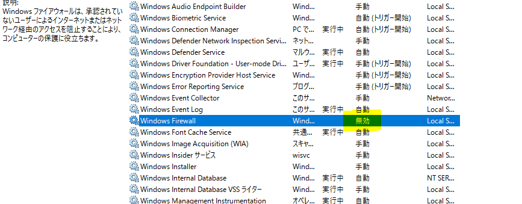

# クライアントの更新プログラムのダウンロードが 0 %で進まない場合のチェックポイント ( WSUS )

みなさま、こんにちは。 WSUS サポート チームです。

よくあるお問い合わせの中で、 WSUS から配信した更新プログラムのダウンロードがクライアント端末上で 0 % から進まず、更新プログラムの適用処理が完了できないといった事象があります。

クライアント側で WSUS から取得する更新プログラムのダウンロードに失敗する要因は様々ございますが、  
今回は、そんなときにまずは一度ご確認いただきたいポイントについてお伝えしようと思います。  
クライアントのダウンロードが進まない、失敗する といったご状況の際はぜひご一読ください。

- **WSUS サーバー上のコンテンツ ファイルの有無を確認**
- **Windows Firewall サービス の無効化についての確認**

上記項目の説明及び確認手順は以下の通りです。

### **＜ 確認手順 : WSUS サーバー上のコンテンツ ファイルの有無を確認 ＞**

＜説明＞  
WSUS サーバーに実体となる更新プログラムのファイルが存在していない場合、  
クライアントは、更新プログラムのダウンロードを実行しても取るファイルが存在しないためダウンロードが進捗しない状況になります。  
この場合、 WSUS サーバー上で、更新プログラムの承認後、実体ファイルのダウンロードが正常にできていない可能性などが疑われます。

＜手順＞  
1． WSUS コンソールで対象の更新プログラムを右クリックし「 ファイル情報 」を参照します。  
  
2．更新プログラムの URI が表示されています。これが更新プログラムの実体ファイルの格納先になります。  
  
3． WSUS サーバーのエクスプローラーから「 WsusContent 」フォルダーを開きます。  
 　 2 ケタの英数字で名づけられたフォルダーが複数存在しますので、手順2 で確認したファイルパス内に記載されているフォルダーをたどっていきます。  
 

4．フォルダー内に格納されているファイルが存在するかを確認します。  
 

### **＜ 確認手順 : Windows Firewall サービス の無効化についての確認＞**

＜説明＞  
OS の標準機能として Windows Firewall のサービス無効化はサポートされておらず、WSUS から更新プログラムをダウンロードする際に利用される Background Intelligent Transfer Service (BITS) と呼ばれるコンポーネントの動作に影響を与えてしまい、正常にダウンロードすることができなくなります。

参考情報 [Background Intelligent Transfer Service](https://docs.microsoft.com/ja-jp/windows/win32/bits/)

＜手順＞  
1．サービス を開き　Windows Firewall もしくは Windows Defender Firewall の名称（サービス名： MpsSvc）を探します。

2．サービスの状態が [無効] となっているかをご確認いただき、無効とされていた場合はスタートアップの種類を [自動] にしてサービスを開始してください。
