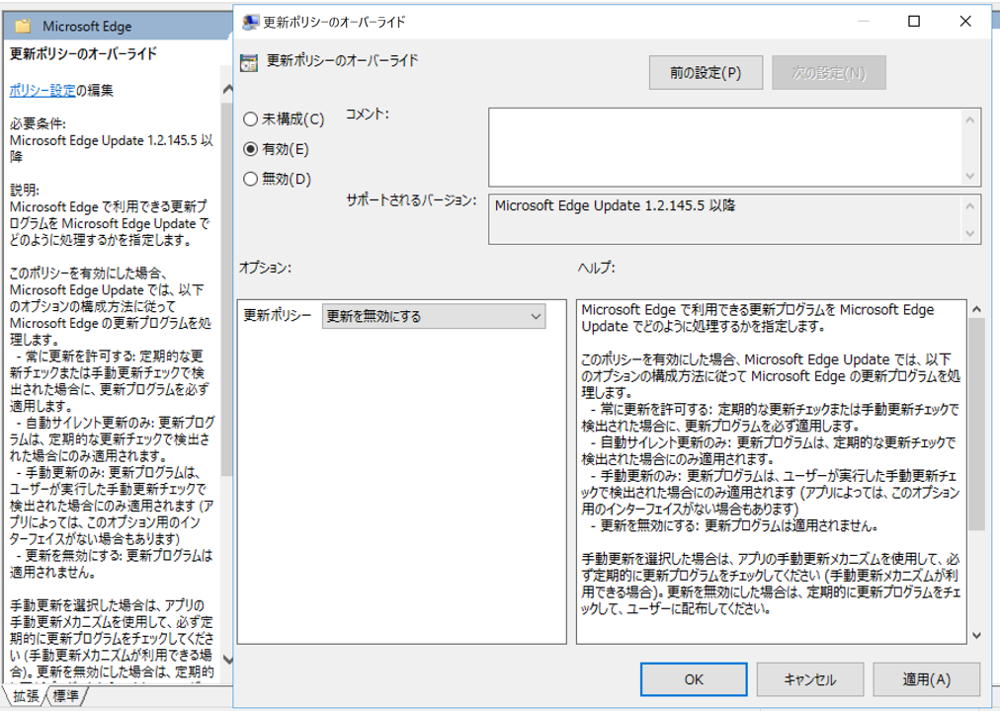
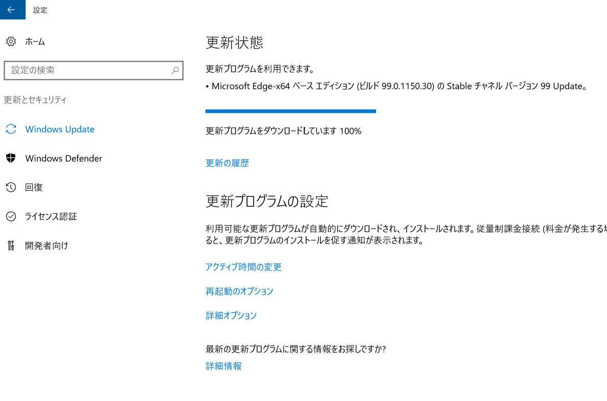

みなさま、こんにちは。 WSUS サポート チームです。

長年皆様にご愛用いただいた Internet Explore のサポートの終了が 2022 年 6 月 15 日に予定されていることが発表されました。  
それに伴い、 Chromium Edge 更新プログラムを WSUS から配信したいとのお問い合わせも増えてきております。  
そこで、今回は WSUS から Chromium Edge へ更新プログラムを配信する方法をご紹介します。

### **WSUS から Chromium Edge 更新プログラム配信する方法**

### 1. Chromium Edge の自動更新を制御する

Chromium Edge には、不具合、パフォーマンス、セキュリティ更新が 既定で 10 時間ごとにブラウザで行われる自動更新という機能があります。  
WSUS から Chromium Edge の更新プログラムを配布する場合は事前に Chromium Edge の自動更新によって勝手にバージョンが上がっていかないよう GPO にて以下の設定が必要です。

ポリシー ： [ 管理用テンプレート ]>[ Microsoft Edge の更新 ]>[ アプリケーション ]>[ Microsoft Edge ]  
[ 更新ポリシーのオーバーライドの規定値 ]：有効：[ 更新を無効にする ] を選択します。  
※このポリシーはドメイン参加環境でのみ効果があります。  
（ Chromium Edge 管理用テンプレ―トは[こちら](https://www.microsoft.com/ja-jp/edge/business/download)から入手可能です。 )  

### 2. WSUS から Chromium Edge の更新を配信する

WSUS コンソールで [ オプション ] > [ 製品と分類 ]  
製品： Microsoft Edge 、分類： 更新 にチェックを追加し、更新プログラムを同期します。  

WSUS にて承認作業を行います。  

クライアント側で更新プログラムが適用されます。  

Chromium Edge のバージョンが更新されます。  

