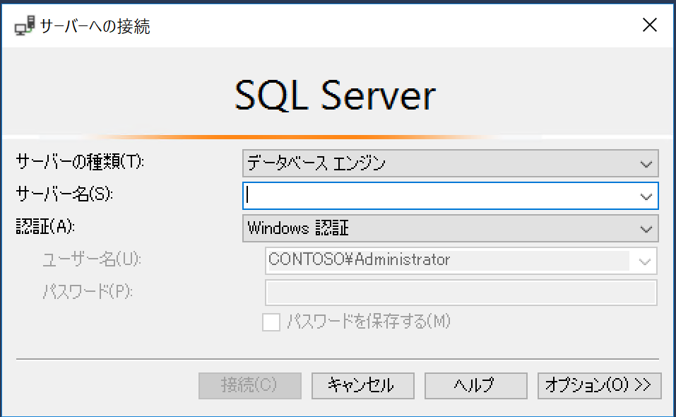
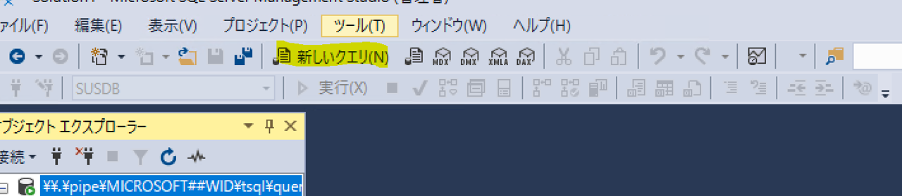

# WSUS メンテナンスガイド新版

みなさま、こんにちは。 WSUS サポート チームです。  
今回は、 WSUS でご実施いただきたいメンテナンスについてご紹介します。  
長期運用や利用状況に従って、 WSUS のパフォーマンスは低下してしまいます。  
WSUS を安定稼働させるためには日頃のメンテナンスが非常に重要となります為、ご利用環境での定期的な実施をご検討ください。

A. IIS チューニング設定  
B. カスタム インデックスの追加  
C. WSUS DB インデックスの再構成  
D. データベースの統計情報の更新とインデックスの再構築  
E. 不要な更新プログラムを「拒否済み」にする  
F. WSUS のクリーンアップ ウィザード  

# A. IIS チューニング設定  
クライアントから大量のスキャンが要求された場合に、WsusPool でメモリのリサイクルが頻発することにより、IIS の保護機能が働き WsusPool が停止するという事象が発生することがあります。その為、予め IIS のチューニング設定を実施することがお勧めです。  
※以下の値はあくまでも参考値ですので、ご利用環境に合わせてパフォーマンスモニターなどをご利用いただきご調整ください。

具体的な手順は以下のとおりです。

1. WSUS サーバー上で IIS マネージャーを起動します。
2. 左ペインより、アプリケーション プールを選択し、中央ペインに表示された WsusPool を右クリックして [詳細設定] をクリックします。
3. 以下の設定を行い、[OK] をクリックします。

[(全般)] -> [キューの長さ] : 2000  
[CPU] -> [制限 (%)] : 0  
[ラピッド フェール保護] -> [エラー間隔 (分)] : 30  
[ラピッド フェール保護] -> [最大エラー数] : 60  
[リサイクル] -> [プライベート メモリ制限 (KB)] : 8000000 (※)  
[リサイクル] -> [仮想メモリ制限 (KB)] : 0

(※) サーバーのメモリ搭載量が 8 GB 未満の場合は、4000000 に設定することをお勧めします。  
搭載量が 20 GB を超える場合は、場合によって 16000000 など大きな値にしても問題ありません。


# B. カスタム インデックスの追加  
データベースにカスタム インデックスを追加しておくことで、クエリパフォーマンスを向上させることができます。  
予めカスタム インデックスを追加しておくことがお勧めです。

具体的な手順は以下のとおりです。

SUSDB データベースでカスタム インデックスを作成するために使用します。  
これは 一度限りの作業であり、データベースのパフォーマンスを大幅に向上させることができるため、
実施いただくことを推奨しております。手順は以下の通りです。

1. SQL Server Management Studio を管理者権限を持つアカウントで起動して、WSUS データベースに接続します。  

  

サーバーの種類 : データベース エンジン  
サーバー名 :  
Windows Internal Database をご利用の場合

```
\\.\pipe\Microsoft##WID\tsql\query
```

SQL サーバーをご利用の場合

```
サーバー名を入力
```

認証 : Windows 認証

2. [新しいクエリ] をクリックし、クエリ ウィンドウに以下の SQL を入力して [実行] をクリックします。  
   

```
-- Create custom index in tbLocalizedPropertyForRevision
USE [SUSDB]

CREATE NONCLUSTERED INDEX [nclLocalizedPropertyID] ON [dbo].[tbLocalizedPropertyForRevision]
(
     [LocalizedPropertyID] ASC
)WITH (PAD_INDEX = OFF, STATISTICS_NORECOMPUTE = OFF, SORT_IN_TEMPDB = OFF, DROP_EXISTING = OFF, ONLINE = OFF, ALLOW_ROW_LOCKS = ON, ALLOW_PAGE_LOCKS = ON) ON [PRIMARY]


-- Create custom index in tbRevisionSupersedesUpdate
CREATE NONCLUSTERED INDEX [nclSupercededUpdateID] ON [dbo].[tbRevisionSupersedesUpdate]
(
     [SupersededUpdateID] ASC
)WITH (PAD_INDEX = OFF, STATISTICS_NORECOMPUTE = OFF, SORT_IN_TEMPDB = OFF, DROP_EXISTING = OFF, ONLINE = OFF, ALLOW_ROW_LOCKS = ON, ALLOW_PAGE_LOCKS = ON) ON [PRIMARY]
```

3. SQL Server Management Studio を閉じます。  

(補足) 以下のようなエラーが発生した場合には、既にカスタムインデックスが作成されていることを示します。

```
メッセージ 1913、レベル 16、状態 1、行 4
'nclLocalizedPropertyID' という名前のインデックスまたは統計が既に テーブル 'dbo.tbLocalizedPropertyForRevision' に存在するので、この操作に失敗しました。
```

参考 [カスタムインデックスを作成する](https://docs.microsoft.com/ja-JP/troubleshoot/mem/configmgr/wsus-maintenance-guide#create-custom-indexes)


# C. WSUS DB インデックスの再構成

運用継続に伴い、データベースが劣化しパフォーマンスが低下していきます。  
インデックスの再構成を実施することにより、断片化比率に応じてデータベースのパフォーマンスを改善します。  
手順については以下のブログでご紹介しておりますのでご参照ください。  
[WSUS DB インデックスの再構成の手順について](https://jpmem.github.io/blog/wsus/2014-03-05_01/)


# D. データベースの統計情報の更新とインデックスの再構築  
A. ～ C. を継続的に実施いただいているご状況でもなお、パフォーマンスの低下が見られる場合には、データベース パフォーマンスの改善を目的として、統計情報の更新クエリ (update statistics)、インデックスの再構築 (DBCC DBREINDEX) をご実施ください。    
※ C. との内容の違いとして、C. は断片化比率に応じてインデックスの再構成を実施していることに対して、D. では全テーブル全インデックスを対象としてインデックスの再構築と統計情報の更新を行っています。  

1. SQL Server Management Studio を管理者権限を持つアカウントで起動して、WSUS データベースに接続します。  

  

サーバーの種類 : データベース エンジン   
サーバー名 :    
Windows Internal Database をご利用の場合  

```
\\.\pipe\Microsoft##WID\tsql\query
```

SQL サーバーをご利用の場合  

```
サーバー名を入力
```

認証 : Windows 認証  

2. [新しいクエリ] をクリックし、クエリ ウィンドウに以下の SQL を入力して [実行] をクリックします。    
  

```
Use SUSDB
exec sp_msforeachtable 'update statistics ? with fullscan'
Go

Use SUSDB
Exec sp_MSForEachtable 'DBCC DBREINDEX (''?'')'
Go
```

処理には数時間を要する場合がございます。完了するまでお待ちください。


# E. 不要な更新プログラムを「拒否済み」にする  

不要な更新プログラムを 「拒否済み」にすることで、 クライアントがスキャン処理をする対象の更新プログラムを減らすことができる為、WSUS の負荷を下げることにつながります。  
実施内容については、以下のブログをご参照ください。

[不要な更新プログラムは「拒否済み」に設定しよう！](https://jpmem.github.io/blog/wsus/2017-12-11_01/)

# F. WSUS のクリーンアップ ウィザード  

WSUS の機能としてクリーンアップウィザードがございます。こちらについても定期的な実施をお勧めしております。  
各実施内容については以下のブログでご紹介しておりますのでご参照ください。  
[WSUS のクリーンアップ ウィザードについて](https://jpmem.github.io/blog/wsus/2017-12-05_01/)

※階層構成（レプリカ）の WSUS をご利用の場合には、実施順序にご留意いただく必要がございます。
以下のブログをご参照ください。  
[レプリカ構成では サーバー クリーンアップ ウィザード にご注意ください](https://jpmem.github.io/blog/wsus/2012-06-07_01/)
