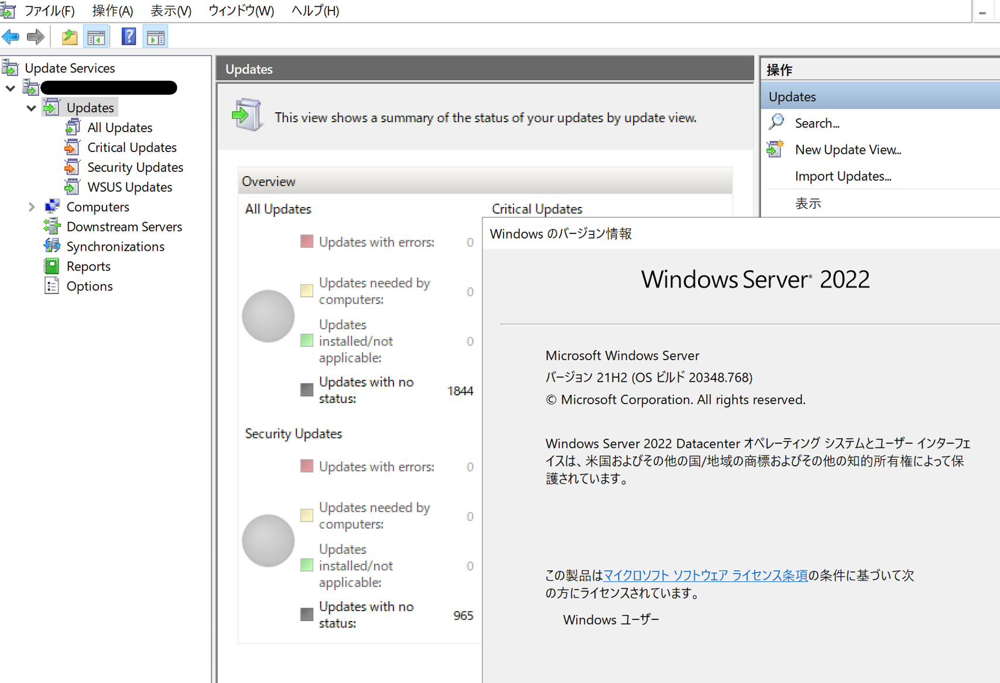

# Window Server 2022 にて WSUS コンソールの言語表示が日本語にならない 
みなさま、こんにちは。WSUS サポート チームです。今回は、Windows Server 2022 における、WSUS コンソールの表示言語で確認された既知の不具合についてお伝えいたします。

# WSUS コンソールの表示言語について  
WSUS コンソールは、OS の言語表示と同じ言語で表示されます。しかしながら、Windows Server 2022 では、2022 年 6 月以前の更新プログラム適用環境において、WSUS コンソールが英語表示のままとなる事象が確認されております。  

# 対処方法  
本事象は弊社既知の不具合として確認されており、本事象に対する修正を含む更新プログラム KB5014665 がリリースされております。この修正内容を含む更新プログラムを適用することにより、WSUS コンソールが、OS の言語表示に従って表示されます。

[2022 年 6 月 23 日セキュリティ以外の更新プログラム (KB5014665)](https://support.microsoft.com/ja-jp/topic/2022-%E5%B9%B4-6-%E6%9C%88-23-%E6%97%A5%E3%82%BB%E3%82%AD%E3%83%A5%E3%83%AA%E3%83%86%E3%82%A3%E4%BB%A5%E5%A4%96%E3%81%AE%E6%9B%B4%E6%96%B0%E3%83%97%E3%83%AD%E3%82%B0%E3%83%A9%E3%83%A0-kb5014665-108cb23c-8e38-4eb4-974a-b5a30d4bc0c4)  

（上記リリース以降の累積更新プログラムには、この修正内容が含まれております。）