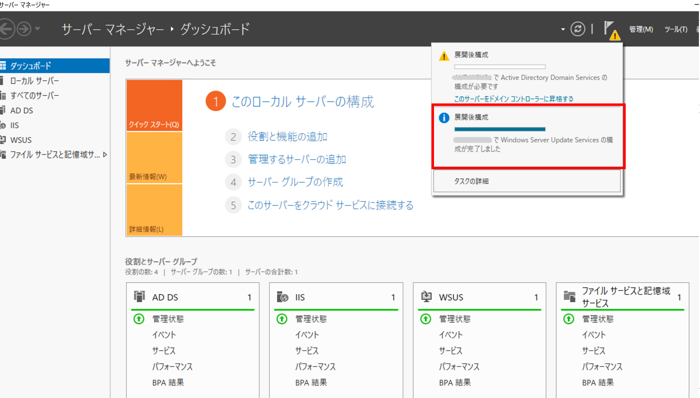

# WSUS 構築マニュアル
みなさま、こんにちは。WSUS サポート チームです。  
今回は、WSUS の概要と構築手順についてご紹介します。WSUS 環境構築予定の方は是非ご一読ください。

---
## WSUS の概要
- WSUS の概要目次  
a. WSUS とは  
b. WSUS を利用するメリット  
 
### a. WSUS とは
WSUS (Windows Server Update Services) とは、Windows OS のコンピューターへの更新プログラムの適用の制御を行うアプリケーションです。  
管理対象の更新プログラムは、Windows OS や Office、Defender 定義ファイルなど様々ございます。  
 
WSUS の主な目的は下記の 2 点となりますので、それぞれメリットを後述させていただきます。  
・更新プログラムの適用状況の一元管理ができる  
・インターネットへの大きなネットワーク トラフィックが発生するリスクがなくなる  

下記公開情報に WSUS の概要が記載されております。  
Title : Windows Server Update Services (WSUS)  
URL : https://learn.microsoft.com/ja-jp/windows-server/administration/windows-server-update-services/get-started/windows-server-update-services-wsus  
 
### b. WSUS を利用するメリット  
下記に WSUS を利用することのメリットをご紹介します。  
 
【更新プログラムの適用状況の一元管理ができる】  
管理対象の社内のクライアント何台にどの更新プログラムが必要なのか、更新プログラムの適用状況を確認することができます。  
なお、適用状況の確認は表やグラフ表示で閲覧できるほか、レポートを PDF や Excel 形式でダウンロードすることも可能です。  
また、WSUS コンソールにて、配信したい更新プログラムを "承認" することで、"承認" された更新プログラムのみが対象のクライアントに配信されますので、インターネットの Windows Update から各クライアントが更新プログラムを受け取る運用と異なり、特定の更新プログラムを配信しないといった選択もできます。  
複数のクライアントをひとまとめにしたコンピューター グループを作成し、そのコンピューター グループに対して更新プログラムを配信するという運用も可能です。  

【インターネットへの大きなネットワーク トラフィックが発生するリスクがなくなる】  
WSUS から配信した更新プログラムは基本的に社内のプライベート ネットワーク経由でクライアントに配信されるため、各クライアントからインターネットへの接続を抑制することが可能です。  
そのため、インターネットへの大きなネットワーク トラフィックが発生するリスクが小さくなります。  

下記弊社ブログで WSUS の基本的な仕組みを紹介しております。  
Title : WSUS の仕組み ダウンロード編  
URL : https://jpmem.github.io/blog/wsus/2022-06-06_01/  

## WSUS 環境構築手順  

- 手順  
a. 役割と機能のインストール  
b. WSUS の設定  

### a. 役割と機能のインストール

サーバー マネージャーを使用して、WSUS サーバー、IIS、Windows Internal Database の役割と機能をインストールします。
なお、WSUS サーバーのデータベースに、SQL Server をご利用の場合は、利用するデータベースを指定する際にインスタンス名をご指定ください。  

1. [サーバー マネージャー] を起動します。  
2. 画面右上の [管理] メニューを選択し、[役割と機能の追加]を選択します。  
3. [開始する前に] ページにて、[次へ] ボタンを選択します。  
4. [サーバーの選択] ページにて、[次へ] ボタンを選択します。  
5. [サーバーの役割] ページにて、[Windows Server Update Services] チェック ボックスをオンにします。
6. [役割と機能の追加ウィザード] ダイアログ ボックスが表示されます。  
   [管理ツールを含める (存在する場合)] チェック ボックスがオンであることを確認し、 [機能の追加] ボタンを選択します。
7. [Web サーバー (IIS)] のチェックが入っていることを確認します。  
8. [次へ] を選択します。  
9. [機能] ページにて、 Windows Internal Database をご利用の場合には　[Windows Internal Database] チェック ボックスがオンであることを確認します。SQL サーバーをご利用の場合には　[Windows Internal Database] チェック ボックスをオフにします。
10. [次へ] を選択します。  
11. [WSUS]ページにて、[次へ] ボタンを選択します。  
12. [役割サービス]ページにて、WSUS で使用するデータベースを指定します。Windows Internal Database をご利用の場合には、WID Connectivity へのチェックをオンにします。SQL サーバーをご利用の場合には、SQL Server Connectivity へのチェックをオンにします。 Windows Internal Database 又は SQL サーバーいずれをご利用の場合も、WSUS Services へのチェックは必ずオンのままとします。
13. [コンテンツ] ページにて、更新プログラムのコンテンツの格納場所となるフォルダー (WsusContent フォルダー) の場所を指定します。
14. 12. にて、SQL Server Connectivity を選択した場合には、DBインスタンスを指定し、[接続を確認する]を押下します。
15. [WSUSサーバーの役割（IIS）]ページにて、[次へ] ボタンを選択します。  
16. [役割サービス]ページにて、[次へ] ボタンを選択します。  
17. [確認] ページにて、[インストール] ボタンを選択します。  
18. WSUS のインストールが完了した後、サーバー マネージャー 右上フラグマークのアイコンより [インストール後のタスクを起動する] をクリックします。 テキストが 「サーバーが構成されるまでしばらくお待ちください」に変わります。 タスクが完了後、 「構成は正常に完了しました」が表示されることを確認します。

### b. WSUS の設定  
1. [サーバー マネージャー] を起動します。  
2. 右上[ツール]より、[Windows Server Update Services] を選択します。
3. [はじめに] ページにて、[次へ]　ボタンを選択します。
4. [Microsoft Update 品質向上プログラム] ページにて、[次へ]　ボタンを選択します。(任意で選択ください)
5. [アップストリームサーバーの選択] ページにて、更新プログラムの同期元を選択します。 
6. プロキシを指定する場合は、[プロキシサーバーの指定] ページにて設定し、[次へ]　ボタンを選択します。
7. [接続の開始] をクリックし、更新情報をダウンロードします。 
8. [言語の選択] ページにて、英語（必須）及び必要に応じて追加言語を指定してください。  
9. [製品の選択] ページにて、同期対象とする製品を選択します。
10. [分類の選択] ページにて、同期対象とする分類を選択します。  
11. [同期スケジュールの設定] ページにて、同期スケジュールを指定します。  
12. [終了] ページにて、初期同期を開始する場合には[初期同期を開始します] チェック ボックスをオンにします。 
13. [完了] ボタンをクリックします。

※8. 言語の選択においては、すべての更新プログラムは英語の言語パックに基づくため、必ず英語を含めてください。  
[WSUS 更新プログラムの言語を選択する](https://learn.microsoft.com/ja-jp/windows-server/administration/windows-server-update-services/plan/plan-your-wsus-deployment#14-choose-wsus-update-languages)   
※9. 製品名に"drivers"や"upgrade & servicing drivers"含まれる製品項目は、ドライバー製品向けの更新プログラムです。該当製品のドライバーに対して更新が必要な場合のみ選択してください。  
※10. 分類についてはこちらをご参照ください。  
 [WSUS の分類について](https://jpmem.github.io/blog/wsus/2018-06-19_01/)  
上記ブログの 「ポイント : 特別な利用がない限り [ドライバ] の分類は絶対に選択しない」 に記載の通り、[ドライバ] の分類は、リリースされている更新プログラムの数が非常に多く、同期対象としますと数万件の更新プログラムが同期され、WSUS のパフォーマンスに大きな影響を与える可能性が高い為、チェックは入れないことをお勧めいたします。

