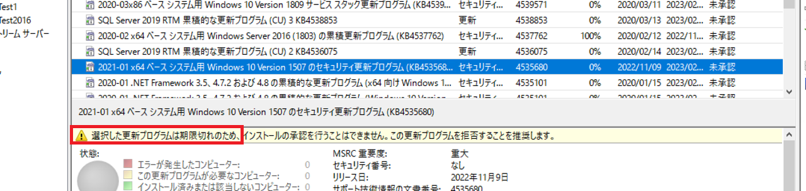

# 期限が切れた更新プログラムについて  
みなさま、こんにちは。WSUS サポート チームです。

今回は、弊社で期限が切れの扱いとした更新プログラムについて、WSUS 上ではどのような動きとなるかご紹介いたします。
是非ご一読いただき、WSUS の動作の理解にお役立てください。

# 期限が切れた更新プログラムとは
弊社開発側で公開を停止した更新プログラムです。期限切れの更新プログラムは、更新プログラムのメタデータの情報に期限切れの内容が加えられ新たな改訂版となります。

# WSUSはいつ期限切れ情報を受け取るか
更新プログラムのメタデータの内容が変更された場合、その改訂版の情報は WSUSの 同期処理の際に受け取る動作となります。
更新プログラムの改訂版についてはこちらの記事をご参照ください。 [「リビジョン（改訂版）」について](https://jpmem.github.io/blog/wsus/2011-10-31_01/)  
なお、既に期限切れとなった更新プログラムについては、これまで同期されていなかった場合、新たにWSUSに着信することはありません。

# 期限切れの更新プログラムに対する WSUS のふるまい　　
期限切れの更新プログラムに対して WSUS 上で承認作業を実施した場合には処理が失敗します。

また、WSUS の既定の動作では、新しい改訂版により期限切れとなった更新プログラムを自動的に拒否済みへ変更する機能が有効化されています。　　

# 期限切れの更新プログラムは承認できるの？　　
期限切れの更新プログラムは新たなリビジョンとして着信します。上述の通り、期限切れのリビジョンに対しては承認ができなくなりますが、過去のリビジョンを承認することができます。ただし、基本的には弊社が公開停止した更新プログラムであるため、置き換えられた新しい更新プログラムを適用することをご検討ください。  
更新プログラムを右クリック > [リビジョン履歴] > 過去のリビジョンを右クリック > [承認]  
  
