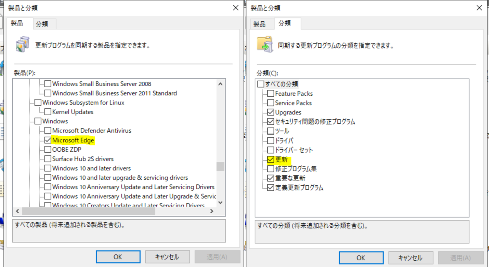
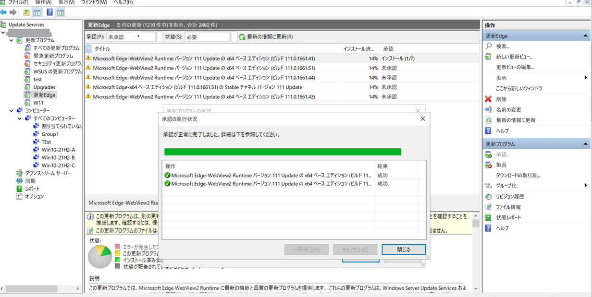
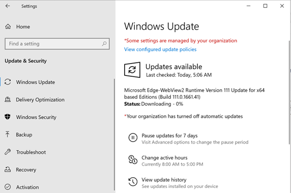
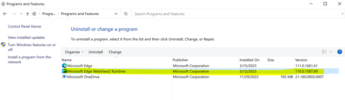
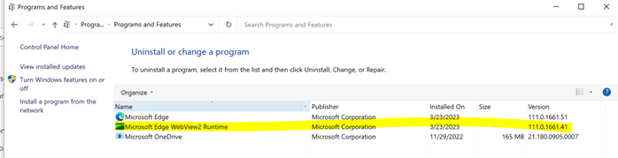

# WSUS 経由で WebView2 を更新する手順 
みなさま、こんにちは。WSUS サポート チームです。

今回は、WSUS 経由で WebView2 Runtime を更新する手順をご紹介いたします。
WSUS より WebView2 Runtime の更新を 管理する場合に参考となるかと存じますので是非ご一読ください。

# 1. WebView2 の自動更新を制御する  
WSUSで WebView2 Runtime の更新を管理する場合、WebView2 Runtime 自動更新を制御しておく必要があります。以下の公開ブログにてご案内させていただいております WebView2 Runtime の更新制御するためのポリシーまたはレジストリを追加いただくようお願いいたします。なお、こちらのポリシーについては Active Directory 配下のクライアントである必要がございますのでご留意ください。  [4) WebView2 の更新制御](https://jpdsi.github.io/blog/internet-explorer-microsoft-edge/how-and-why-to-update-edge/#4-WebView2-%E3%81%AE%E6%9B%B4%E6%96%B0%E5%88%B6%E5%BE%A1)

# 2. WSUS から WebView2 の更新を配信する  
WSUS コンソールで [ オプション ] > [ 製品と分類 ] を開きます。
製品： Microsoft Edge 、分類： 更新 にチェックを追加し、更新プログラムを同期します。  
  

WebView2 Runtime 向けの更新プログラムが同期されますので、WSUS にて承認作業を行います。  

クライアントが WSUS にアクセスしたタイミングで承認情報を受け取り、更新プログラムの適用処理が行われます。具体的には、クライアントは、（ランダム時間を含む）既定で約 22 時間毎に WSUS へ検出処理が行われ、自動更新の設定に基づきダウンロード、インストールの処理を実施します。  

WebView2 Runtime のバージョンが更新されます。  
更新プログラム適用前  

 
更新プログラム適用後  

※ 上記は WebView2 Runtime のバージョンを WSUS 経由で更新する際の手順となります。WebView2 Runtime の初期インストールにつきましては、本手順で WSUS から配信することはできませんのでご留意ください。  

