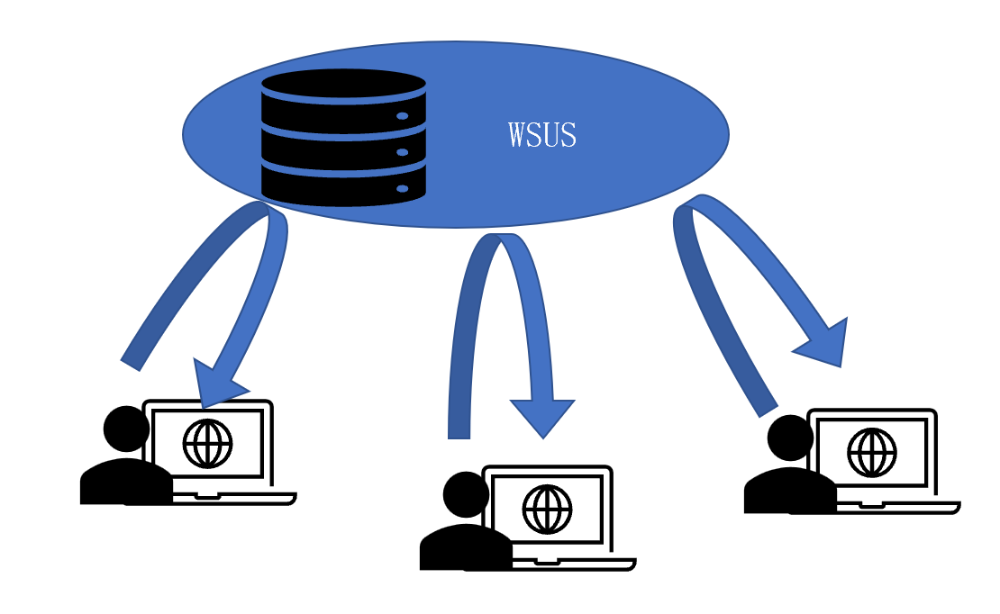
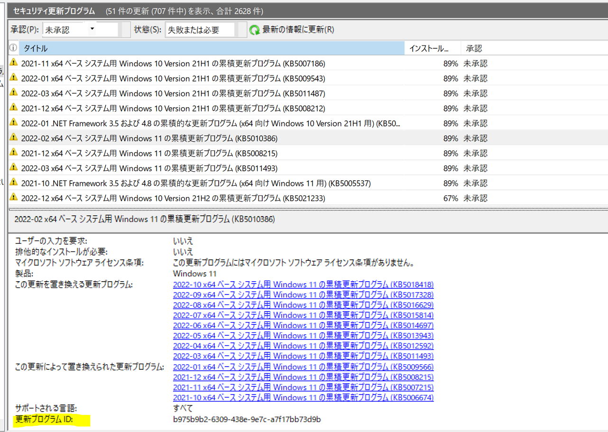

# WSUS の仕組み クライアント編
みなさま、こんにちは。WSUS サポート チームです。

今回は、WSUS クライアントの仕組みについて、ご紹介していきたいと思います。  
クライアント はどのような流れで WSUS から更新プログラムの取得するのか、その仕組みについてご紹介したいと思います。仕組みの理解やトラブルシューティングの際にお役立ていただける情報となっていますので是非ご一読ください！  

# WSUS クライアントの仕組み  

クライアントが WSUS から更新プログラムを取得するまでの流れは以下の通りです。
1. WSUS へ検出処理を実施  
2. 承認情報の取得  
3. ダウンロード及びインストール処理実施  

解説

1. WSUSサーバーへ検出処理を実施  
クライアントは、自動更新の検出動作に基づき、既定で約 22 時間毎に WSUS へ更新プログラムの検出処理を行い、自らに適用が可能か否かを確認する処理を行っています。更新プログラムのメタデータには、検出ロジックと呼ばれる検出条件が組み込まれており、クライアントが更新プログラムを検出するためには、その条件を満たしていることが必要です。WSUS へ検出処理を行う際は、WSUS の IIS を介して WSUS データベース (SUSDB) にアクセスする動作となります。なお、検出処理完了後、クライアントは 更新プログラムの適用状態などを状態レポートとして WSUS へ送信します。状態レポートの詳細については、[WSUS の仕組み レポート編](https://jpmem.github.io/blog/wsus/2022-07-07_01/)  をご参照下さい。

以下は検出条件の一例です。  
◆2023-04 x64 ベース システム用 Windows 10 Version 22H2 の累積更新プログラム (KB5025221)  
•	2021 年 5 月 11 日 (KB5003173) 以降の LCU がない場合は、2021 年 8 月 10 日SSU (KB5005260) がインストールされていること  

◆Windows 11(ビジネス エディション)バージョン 22H2 ja-jp x64  
・Windows 10 Version 1909 以降であること  
・システム要件を満たしていること  

※検出条件は更新プログラムごとに異なり、上記はあくまでも検出条件の部分的な一例となりますので参考までとしていただけますと幸いです。

2.承認情報の取得  
WSUS サーバーで承認されており、かつ、1 の検出処理で検出された更新プログラムのみがダウンロードされます。

3.ダウンロード及びインストール処理実施  
自動更新の設定に基づき、ダウンロード及びインストールの処理が行われます。  
クライアントは IIS を介して WSUS サーバーの WSUSContent フォルダにアクセスし、その中に格納された更新プログラムコンテンツファイルをダウンロードします。  
コンテンツファイルの格納先の確認方法については、[WSUS の仕組み ダウンロード編](https://jpmem.github.io/blog/wsus/2022-06-06_01/)  の記事下方の補足情報に記載がございますのでご参照下さい。  
コンテンツファイルのダウンロード後、OS 側に処理が引き継がれ更新プログラムのインストールが行われます。なお、検出処理完了後と同様に、ダウンロード完了後、インストール完了後にクライアントは WSUS へ状態レポートを送信します。

参考情報：  
[自動更新の構成](https://learn.microsoft.com/ja-jp/windows-server/administration/windows-server-update-services/deploy/4-configure-group-policy-settings-for-automatic-updates#configure-automatic-updates)  
[自動更新の検出頻度](https://learn.microsoft.com/ja-jp/windows-server/administration/windows-server-update-services/deploy/4-configure-group-policy-settings-for-automatic-updates#automatic-updates-detection-frequency)

# トラブルシュート方法 
更新プログラムの適用に失敗するなどの事象発生時にはログを確認し、どのフェーズで失敗しているかを確認することが問題の切り分けに有効な手段となります。検出、ダウンロード、インストールの処理については、ReportingEvents.log にて簡易的にご確認いただけます。ログの見方については、[ReportingEvents.log の見方](https://jpmem.github.io/blog/wsus/2018-02-02_01/)をご参照ください。  
（インストール処理のログについては、その更新プログラムの名称が記録されますが、ダウンロード処理のログに関しては、更新プログラムの UpdateID で記録されます。※UpdateID は WSUS コンソールにて更新プログラムをクリックした際の下方に表示される "その他の詳細" より確認いただけます。）

