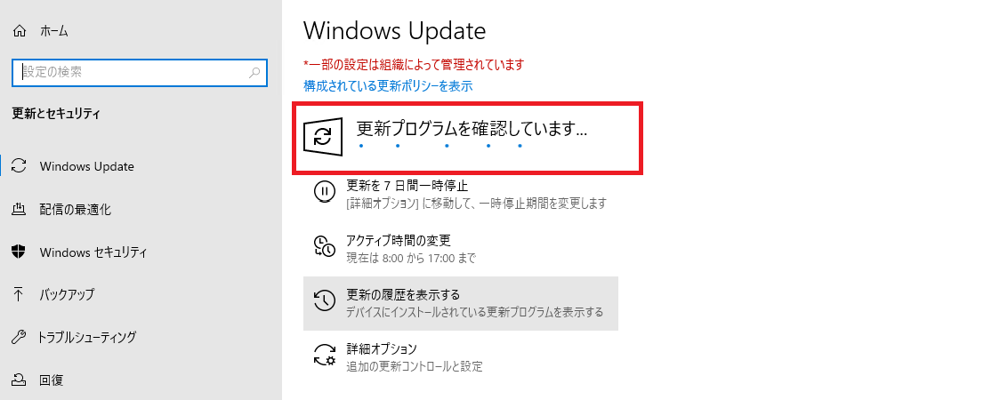

# WSUS で更新プログラムが配信されないときのチェックポイント
みなさま、こんにちは。WSUS サポート チームです。

今回は、WSUS から更新プログラムが配信されない問題が発生したときのチェックポイントをご紹介します。  
WSUS から更新プログラムが配信される仕組みについては、[こちらの記事](https://jpmem.github.io/blog/wsus/2023-05-02_01/)でご紹介しておりますので、こちらも是非ご確認ください。

# 設定値のチェック
WSUS クライアントの接続先となる WSUS サーバーについては、以下のドメイン ポリシー / ローカル ポリシーやレジストリで指定します。  

- ポリシー  
**[コンピューターの構成] - [管理用テンプレート] - [Windows コンポーネント] - [Windows Update] - [イントラネットの Microsoft 更新サービスの場所を指定する]**  
または  
**[コンピューターの構成] - [管理用テンプレート] - [Windows コンポーネント] - [Windows Update] - [Windows Server Update Service から提供される更新プログラムの管理] - [イントラネットの Microsoft 更新サービスの場所を指定する]**  

これらのポリシーが構成されると、下記レジストリ値がセットされます。

- レジストリ  
**HKEY_LOCAL_MACHINE\SOFTWARE\Policies\Microsoft\Windows\WindowsUpdate**  
**WUServer: <WSUS サーバーの URL>**  
**WUStatusServer: <WSUS サーバーの URL>**  
**HKEY_LOCAL_MACHINE\SOFTWARE\Policies\Microsoft\Windows\WindowsUpdate**  
**UseWUServer: 1**  

まずはレジストリ エディター (regedit) より、このレジストリに正しい値がセットされているかを確認しましょう。  
もし、想定しない WSUS サーバーの URL がセットされている場合は、ドメイン ポリシーまたはローカル ポリシーの設定値を見直して、正しい値をセットしてください。

# クライアントと WSUS の疎通チェック
WSUS クライアントが WSUS サーバーから更新プログラムを受信するためには、WSUS サーバーに対して HTTP リクエストが送信できるネットワーク環境である必要があります。  
WSUS サーバーの接続先となる URL については、上述で説明したレジストリ値に格納されています。  
URL が IP アドレスではなく FQDN やホスト名になっている場合、名前解決ができるか確認する必要がありますので、まずはターミナルや PowerShell コンソールを開いて以下のコマンドを実行し IP アドレスを取得できるか確認しましょう。

例) URL が http://WSUS.contoso.com:8530 の場合
```
nslookup WSUS.contoso.com
```

出力例  
```
Server:  UnKnown
Address:  192.168.1.1

Name:    WSUS.contoso.com
Address:  192.168.1.10
```

ここで IP アドレスが取得できなかった場合、名前解決失敗エラーとなりますので、DNS の設定や FQDN が正しいか見直してください。  
名前解決ができることを確認した後は、以下の PowerShell コマンドを実行して、この URL に対して、HTTP リクエストが送信できるかどうかを確認しましょう。  

例) URL が http://WSUS.contoso.com:8530 の場合
```
Invoke-WebRequest -Uri http://WSUS.contoso.com:8530/ClientWebService/Client.asmx?wsdl -UseBasicParsing
Invoke-WebRequest -Uri http://WSUS.contoso.com:8530/SimpleAuthWebService/SimpleAuth.asmx -UseBasicParsing
```

アクセス可能な場合は、以下のように StatusCode 200 の出力結果となりますので、このような出力となるかご確認ください。  

出力例  
```
StatusCode        : 200
StatusDescription : OK
...<省略>
```

# プロキシ設定を確認する
もし、更新プログラムの確認時に StausCode が 407 の Proxy Authentication Required エラーなどが返された場合、プロキシを経由して WSUS サーバーにアクセスした結果、認証ができずに失敗していることが疑われます。  
そのときは、以下のコマンドで WinHTTP のプロキシ設定を確認してください。  

```
netsh winhttp show proxy
```

もし、設定されている場合、バイパスリストに WSUS サーバーの FQDN やそのドメインが含まれていなければ、プロキシを経由することになります。  
その場合は、プロキシ設定が不要であればリセットするか、バイパスリストに WSUS サーバーを追加することをご検討ください。  

- リセットするコマンド
```
netsh winhttp reset proxy
```

- バイパスリストを追加するコマンド  
例) URL が http://WSUS.contoso.com:8530 の場合
```
netsh winhttp set proxy proxy-server="<既存のプロキシ サーバー名>" bypass-list="<既存のバイパス リスト>;WSUS.contoso.com"
```
※ ドメイン名をバイパス リストに追加する場合は、*.contoso.com としてください。

プロキシを経由していないにもかかわらず、StausCode が 503 などのサーバー エラーが返された場合、WSUS サーバー側で問題が発生している可能性があるので、次の確認に進みます。

# WSUS サーバーの正常性チェック
WsusPool の停止などによって、WSUS サーバーが正常に動作していない場合、クライアントからの更新プログラムの確認がエラーとなります。  
WsusPool の停止が発生している場合、WSUS 管理コンソールが開けない状態となりますので、まず WSUS サーバーにログオンし、WSUS 管理コンソールを起動して、情報が確認できるかどうかご確認ください。  

WSUS コンソール起動時にエラーが発生して情報が確認できない場合は、[WSUS コンソールが全く開かなくなってしまった！ WsusPool の停止とは](https://jpmem.github.io/blog/wsus/2022-05-23_01/) の記事をもとに対処を実施しましょう。

# Windows Update クライアントの情報をクリアする
ネットワークやサーバー側に問題がなかった場合、Windows Update クライアントがキャッシュしているファイルの問題の影響で、問題が発生している可能性があります。  
その場合は、以下の手順で Windows Update クライアントの情報をクリアにした後、事象が解消されるかどうかご確認ください。

## 注意事項 
- [更新履歴の表示] の情報がクリアされます。(作業履歴の情報ですので 現時点の適用状態や今後の適用動作には全く影響ありません)
- 過去クライアント側の操作によって「非表示」設定（処理対象から除外）していた更新プログラムが存在する場合は、その設定が解除されます。
- 次回 WSUS にアクセスした際にキャッシュされていた情報を再ダウンロードします。 そのため、同時に多数の端末が実施した場合にはネットワークの負荷が発生する場合があります。

## 手順
以下ステップを順にご実施ください。

**1. Windows Update 関連サービスの停止**  
**2. SoftwareDistribution フォルダーのリネーム**  
**3. BITS のジョブを削除 (Windows 11 の場合、本手順は不要です。)**  
**4. Windows Update 関連サービスの開始**  
**5. 更新プログラム検出の確認**

各手順の詳細は以下の通りです。

### **1. Windows Update 関連サービスの停止**  
管理者として実行にて起動したコマンド プロンプト、またはターミナルから以下のコマンドを実行して、サービスを停止します。  
- Windows Server 2012 / 2012 R2 の場合
```
net stop wuauserv
net stop bits
```

- Windows Server 2016 の場合
```
net stop usosvc
net stop wuauserv
net stop bits
```

- Windows 10 / Windows 11 / Windows Server 2019 以降の場合
```
net stop usosvc
net stop wuauserv
net stop bits
net stop dosvc
```

### **2. SoftwareDistribution フォルダーのリネーム**  
以下のコマンドを実行して、更新プログラムが保存されている SoftwareDistribution フォルダーをリネームします。  
SoftwareDistribution フォルダーは、Windows Update に使用されます。例えば Software Distribution フォルダー配下の Download フォルダーにはダウンロードされた更新プログラムが一時的に保管されます。SoftwareDistribution フォルダーをリネームすることで、これまでダウンロードされた更新プログラムやデータベースの情報がクリアされます。  

コマンド プロンプトの場合
```
ren %systemroot%\SoftwareDistribution SoftwareDistribution.old
```

PowerShell コンソール / ターミナルの場合
```
Rename-Item "$env:systemroot\SoftwareDistribution" "$env:systemroot\SoftwareDistribution.old"
```

### **3. BITS のジョブを削除 (Windows 11 の場合、本手順は不要です。)**  
以下のコマンドを実行して、ダウンロード中の BITS ジョブを削除します。  
Windows 10 までの Windows Update は BITS という Windows の機能を利用して、アイドル中のネットワーク回線の帯域幅を使用して、バックグラウンドで更新プログラムをダウンロードします。ダウンロードに失敗した更新プログラムが BITS キューに滞留している場合、以下のコマンドを順番に実行してキューから削除することで、新しくダウンロード ジョブが作成され、ダウンロードに成功する可能性があります。  

- Windows 10 バージョン 1703 以前、Windows Server 2012 / 2012 R2 / 2016 の場合  

コマンド プロンプトの場合
```
del %ALLUSERSPROFILE%\Microsoft\Network\Downloader\qmgr0.dat
del %ALLUSERSPROFILE%\Microsoft\Network\Downloader\qmgr1.dat
```
PowerShell コンソール / ターミナルの場合
```
Remove-Item "$env:allusersprofile\Microsoft\Network\Downloader\qmgr0.dat"
Remove-Item "$env:allusersprofile\Microsoft\Network\Downloader\qmgr1.dat"
```

-  Windows 10 バージョン 1703 以降 / Windows Server 2019 以降の場合

コマンド プロンプトの場合
```
del /Q %ALLUSERSPROFILE%\Microsoft\Network\Downloader\*
```
PowerShell コンソール / ターミナルの場合
```
Remove-Item "$env:allusersprofile\Microsoft\Network\Downloader\*"
```

### **4. Windows Update 関連サービスの開始**  
以下のコマンドを実行して、項番 1) で停止したサービスを開始します。最初から停止済みのサービスがあった場合は、開始しなくても構いません。
- Windows Server 2012 / 2012 R2 の場合
```
net start wuauserv
net start bits
```

- Windows Server 2016 の場合
```
net start usosvc
net start wuauserv
net start bits
```

- Windows 10 / Windows 11 / Windows Server 2019 以降の場合
```
net start usosvc
net start wuauserv
net start bits
net start dosvc
```

### **5. 更新プログラム検出の確認** 
上記の手順を実施して Windows Update クライアントの情報をクリアした後、以下の手順で更新プログラムの確認を実行します。  
Windows 10 / Windows Server 2016 以降 / Windows 11 の場合、更新プログラムのチェック実行後、更新プログラムを検出すると、更新プログラムのインストールが開始されることがありますので、予めご留意ください。
- Windows Server 2012 / 2012 R2 の場合  
[コントロール パネル] - [システムとセキュリティ] - [Windows Update] を開き [更新プログラムの確認] をクリック  
- Windows 10 / Windows Server 2016 以降の場合  
[設定] - [更新とセキュリティ] - [Windows Update] を開き [更新プログラムのチェック] をクリック
- Windows 11 の場合  
[設定] - [Windows Update] を開き [更新プログラムのチェック] をクリック  

コマンドで実行する場合は、以下のコマンドを実行してください。
- Windows Server 2012 / 2012 R2 の場合
```
wuauclt /detectnow
```
- Windows 10 / Windows 11 / Windows Server 2016 以降の場合  
コマンド プロンプトから実行可能なコマンドは用意されておりませんので、以下の PowerShell コマンドを PowerShell コンソールやターミナルより実行してください。
```
$AutoUpdates = New-Object -ComObject "Microsoft.Update.AutoUpdate"
$AutoUpdates.DetectNow()
```
※ 上記 PowerShell コマンドによる検出処理の実行につきましては Windows 10 version 1709 以降のバージョンでは下記ポリシーにて設定いただいている検出頻度 (既定では 22 時間) 以内で実行した場合に、ブロックされる処理が組み込まれており、実行されませんので、ご留意ください。

**[コンピューターの構成] - [管理用テンプレート] - [Windows コンポーネント] - [Windows Update] - [自動更新の検出頻度]**

例えば、最後に「更新プログラムのチェック」が実行された時刻が 1 時の場合、このコマンドは既定値ですと 22 時間後である 23 時までの間機能しないということです。本 PowerShell コマンドを実行して、機能した場合、以下のように [Windows Update] 画面に「更新プログラムを確認しています...」が表示されます。



# 上記のいずれも問題なかった場合
WSUS サーバーも問題なく動作しており、クライアントとサーバー間の接続も問題なかった場合は、WSUS サーバーのパフォーマンス劣化により、クライアントからのリクエストに対する応答に時間がかかることで、タイムアウト エラーが発生している可能性があります。  
この場合は、まず対象の WSUS サーバーで [WSUS メンテナンスガイド新版](https://jpmem.github.io/blog/wsus/2022-05-09_01/) を実施いただき、WSUS サーバーのメンテナンスを実施しましょう。これによって、パフォーマンスを改善し、応答までの時間短縮を試みます。  

これでもタイムアウトが発生する場合は、可能な限り WSUS サーバー側で不要な更新プログラムを「拒否済み」に設定する対処方法が効果的です。  
例えば、Windows Server 2016 など、リリースされてから時間が経過している OS の累積更新プログラムについては、過去の更新プログラムとの置換関係を保持し続けている関係上、カタログ情報（メタデータ）が肥大化しているため、「未承認」や「インストール承認」の更新プログラムが多いと、タイムアウト エラーなどが発生しやすくなります。  

OS の累積更新プログラムについては、最新の更新プログラムを配信していれば、それによって置き換えられた更新プログラムを配信しても、クライアント側に配信されませんので、特別な要件が無い限り「未承認」や「インストール承認」のままにしておく必要はありません。  
例えば、2023 年 6 月の Windows Server 2016 累積更新プログラムを「インストール承認」している場合、それによって置き換えられた更新プログラムは「拒否済み」にすることができます。  
「拒否済み」については、[不要な更新プログラムは「拒否済み」に設定しよう！](https://jpmem.github.io/blog/wsus/2017-12-11_01/)にて紹介していますので、実施をご検討ください。

