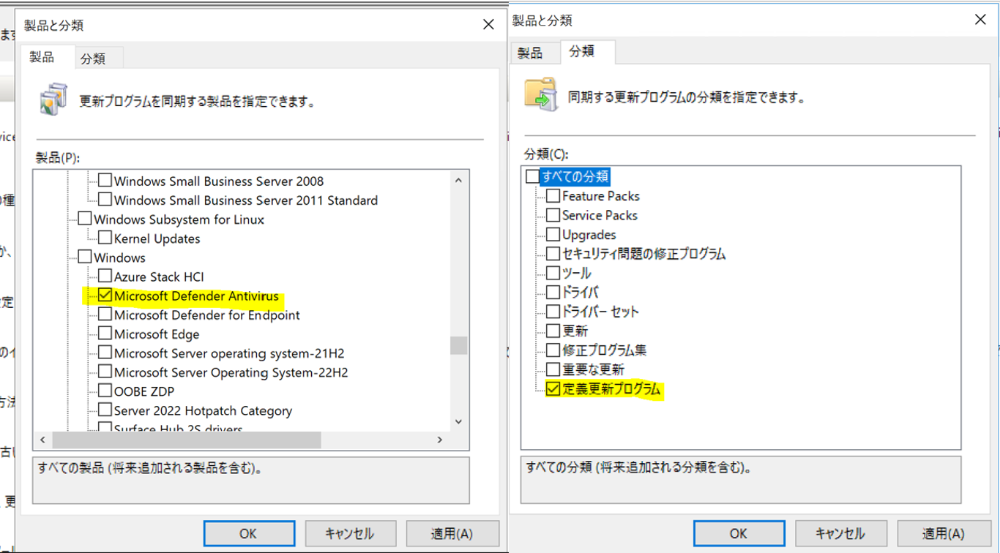
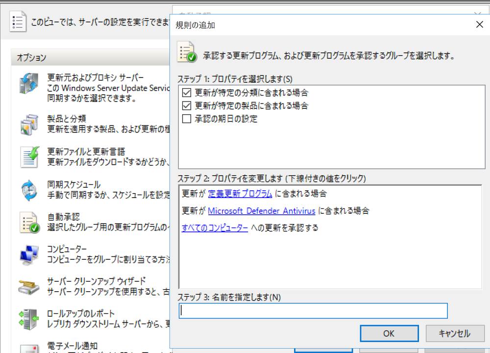

# WSUS から Microsoft Defender Antivirus 向けに定義更新プログラムを配布する方法について
みなさま、こんにちは。WSUS サポート チームです。今回は、Microsoft Defender Antivirus 向けに定義更新プログラムを配布する方法をご紹介いたします。WSUS で必要な手順についてお伝えいたしますのでお役立ていただけますと幸いです。

# 配布手順  

## 1.WSUS に Microsoft Defender Antivirus の定義更新プログラムを同期する　　
WSUS で Microsoft Defender Antivirus 向けの定義更新プログラムを配布するために必要な設定についてお伝えします。  
1-1 WSUS コンソール上から[ オプション ]>[ 製品と分類 ]を選択します。  
1-2 製品タブにて： [ Microsoft Defender Antivirus ] にチェックを入れます。  
1-3 分類タブにて： [ 定義更新プログラム ] にチェックを入れます。
  
 

## 2.自動承認機能を利用して配布する
WSUS の自動承認機能を利用し、自動承認規則に基づいて同期実行時に更新プログラムのメタデータが WSUS サーバーにダウンロードされたタイミングで自動的承認を行うように設定できます。

2-1 WSUSコンソール上から [ オプション ] > [ 自動承認 ] を選択します。  
2-2 [ 新しい規則 ] を選択します。  
2-3 [ ステップ1．プロパティを選択します ] にて [ 更新が特定の分類に含まれる場合 ] にチェックを入れます。 [ ステップ2．プロパティを変更します (下線付きの値をクリック) ] にて [ 任意の分類] をクリックし、[ 定義更新プログラム ] を選択します。  
2-4 [ ステップ1．プロパティを選択します ] にて [ 更新プログラムが特定の製品に含まれる場合 ] にチェックを入れます。 [ ステップ2．プロパティを変更します (下線付きの値をクリック) ] にて [ 任意の製品 ] をクリックし、[ Microsoft Defender Antivirus ] を選択します。  
2-5 [ すべてのコンピューター ] をクリックし、承認対象とするコンピュータグループを選択します。  
2-6 [ ステップ3．名前を指定します ] にて任意の規則名を入力します。
   

＜参考＞  
[WSUS を使用して、Windows Defender を実行しているコンピューターに定義の更新を展開する](https://docs.microsoft.com/ja-jp/troubleshoot/mem/configmgr/deploy-definition-updates-using-wsus)  
[更新プログラムの自動承認](https://docs.microsoft.com/ja-jp/security-updates/windowsupdateservices/18111597)  
[スタンドアロン WSUS の定義ファイルの更新を同期する](https://docs.microsoft.com/ja-jp/mem/configmgr/protect/deploy-use/endpoint-definitions-wsus#synchronize-definition-updates-for-standalone-wsus)  

# 留意いただきたい事項 
定義更新プログラムを WSUS から配信する環境においては、サーバー負荷がかかりやすい状態となりやすいことにご留意ください。
特に Microsoft Defender Antivirus 向けの定義更新プログラムは、１日に複数回リリースされます為、更新プログラムの数が日々増加し、WSUS データベースに保持される更新プログラムのメタデータの数が非常に多くなる傾向があります。このことにより、WSUSサーバーの負荷を高める要因なりますため、定期的なメンテナンスの実施をお勧めいたします。メンテナンス方法については、[WSUS メンテナンスガイド新版](https://jpmem.github.io/blog/wsus/2022-05-09_01/) にてご紹介しておりますのでご参照ください。