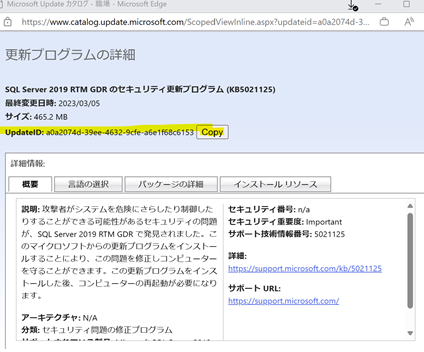
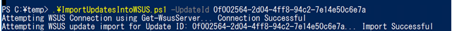
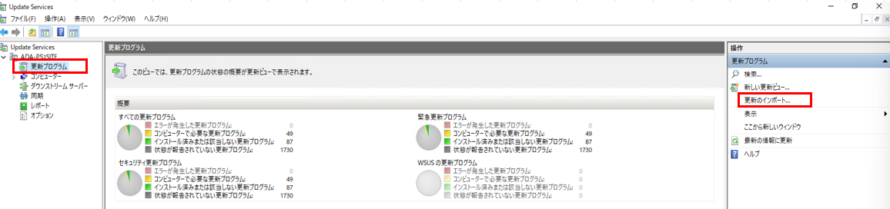

# Microsoft Update カタログから更新プログラムをインポートする手順が変更されました  
  
**2023/07/27 初版公開**  
**2024/05/09 更新**  
**- スクリプト エラーとなった際の対処策を追記しました。**  

みなさん、こんにちは。WSUS サポート チームです。  

これまで WSUS コンソールから更新プログラムをインポートする方法がありましたが、使用機能の ActiveX が非推奨になったことから、ActiveX を介さず PowerShell を使用してインポートする方法をご紹介します。

# 手順
1. 以下の公開情報に記載されているスクリプトをコピーし拡張子.ps1として、 WSUS サーバーへ保存します。

Title : Import updates into WSUS using PowerShell  
URL : https://learn.microsoft.com/en-us/windows-server/administration/windows-server-update-services/manage/wsus-and-the-catalog-site?branch=pr-4097#powershell-script-to-import-updates-into-wsus

2. Microsoft Update カタログ サイトをブラウザーで開きます。
https://catalog.update.microsoft.com

3. WSUS にインポートする更新プログラムを検索します。   
4. 対象の更新プログラムをクリックします。  
5. 開いた詳細ページで UpdateID をコピーします。  

 

6. 管理者として PowerShell コンソールを開きスクリプトの配置パスまで移動させ、ドキュメントに記載されている構文を使用してスクリプトを実行します。  
例　.\ImportUpdateToWSUS.ps1 -UpdateId <コピーした UpdateID>  
  

手順は以上です。  

上記の手順は、米国エンジニアが公開した以下ブログを参考にしています。日本語に訳してご紹介します。

Title : Importing updates into WSUS is changing  
URL : https://techcommunity.microsoft.com/t5/windows-it-pro-blog/importing-updates-into-wsus-is-changing/ba-p/3882937  

なお、スクリプト実行時にエラーとなった場合は、手順 1. にてご案内いたしましたスクリプトの ".NOTES" に記載の手順をご実施ください。  
こちらを実施後も事象に変化が見られない場合は、弊社サポートへのお問い合わせをご検討いただけますと幸いです。  

___
Windows Server Update Services（WSUS）を使用してデバイスを更新する場合、更新プログラムのインポート手順が変更されました。更新プログラムのインポートには、新しいPowerShellスクリプトを使用します。デバイスを定期的に更新し、可能な限り安全な方法で更新を行うことで、組織のデバイスの保護がさらに強化されます。その方法を見てみましょう！

# 更新プログラムを WSUS にインポートする古い手順
これまで、WSUSには Microsoft Update カタログ サイトから更新プログラムをインポートするオプションがありました。このオプションは WSUS 管理コンソール上の **更新プログラム** > **操作** ペインにあります。

[更新のインポート] オプションは、WSUS 管理コンソールの [更新プログラム] > [操作] ペインにあります。

このユーザー インターフェイスの動作が変更されています。**更新プログラムのインポート機能** は、ActiveXを使用して構築されていましたが、現在は非推奨となっています。デバイスを最新の状態に保つための新しく優れた方法が利用できるようになりました！

# 更新プログラムを WSUS にインポートする新しい手順
新しい PowerShell スクリプトは、WSUS 内のインポート機能を置き換えるものです。このスクリプトを使用して更新プログラムをダウンロードし、WSUS サーバーにインポートします。

この新しいスクリプトを取得するには、2つの方法があります：

a. WSUS 管理コンソールで通常の手順に従ってください： **更新プログラム** > **操作** をクリックすると、スクリプトを含むドキュメントにリダイレクトされます。
b. 直接、公開情報「WSUS とカタログ サイト」にアクセスし、PowerShell スクリプトを入手します。

スクリプトをコピーしたら、PowerShell を使用して WSUS にアップデートをインポートする一連の手順を実行します。簡単に説明すると、以下のようになります：

1. スクリプトを保存します。
2. Web ブラウザで Microsoft Update カタログ サイトを開きます。
3. WSUS にインポートする更新プログラムを検索します。
4. 表示された一覧から、目的の更新プログラムを選択します。
5. 開いた詳細ページの UpdateID をコピーします。
注: 複数の更新プログラムをインポートする場合は、UpdateID をそれぞれ別の行に記述したテキストファイルを作成します。
6. 更新プログラムをインポートするには、PowerShell コンソールを管理者として開き、ドキュメントに記載されている構文でスクリプトを実行します。

~~~~~~~
注意:
インポートされた更新プログラムのファイルは、インポート時にはダウンロードされません。更新プログラムのファイルの設定を確認し、ダウンロードされるタイミングを確認または変更してください。
~~~~~~~

更新プログラムのインポートに関する完全で最新のガイダンスについては、WSUS および Microsoft Update カタログのページを引き続き確認してください。このページには、スクリプト、構文、および役立つ例が掲載されています。

もし情報が足りないと感じたら、以下のリソースをご覧ください：  
[WSUS とカタログ サイト](https://learn.microsoft.com/ja-jp/windows-server/administration/windows-server-update-services/manage/wsus-and-the-catalog-site)  
[Microsoft Update Catalog](https://www.catalog.update.microsoft.com/Home.aspx)  
[ActiveX コントロール](https://learn.microsoft.com/ja-jp/cpp/mfc/activex-controls?view=msvc-170)  
