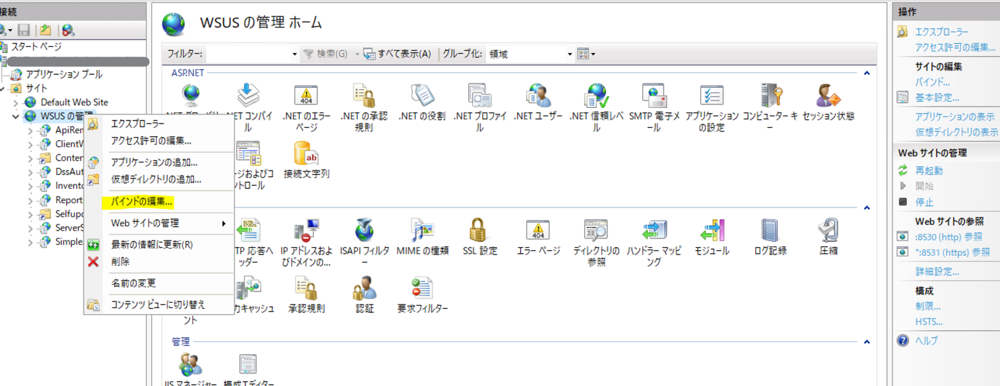
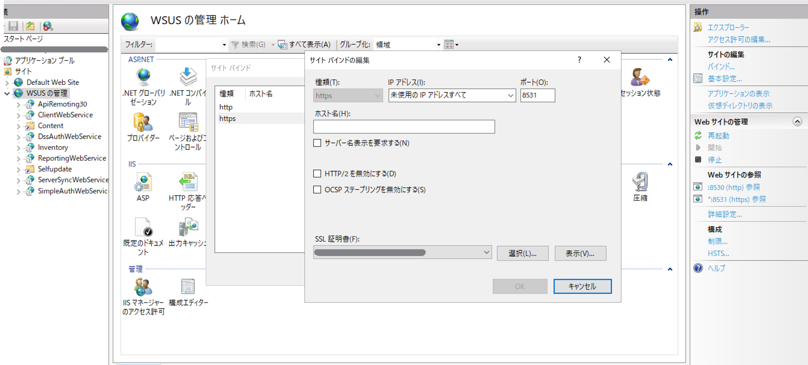
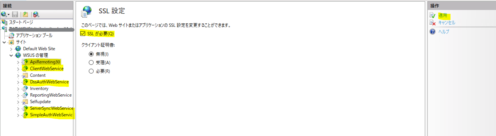
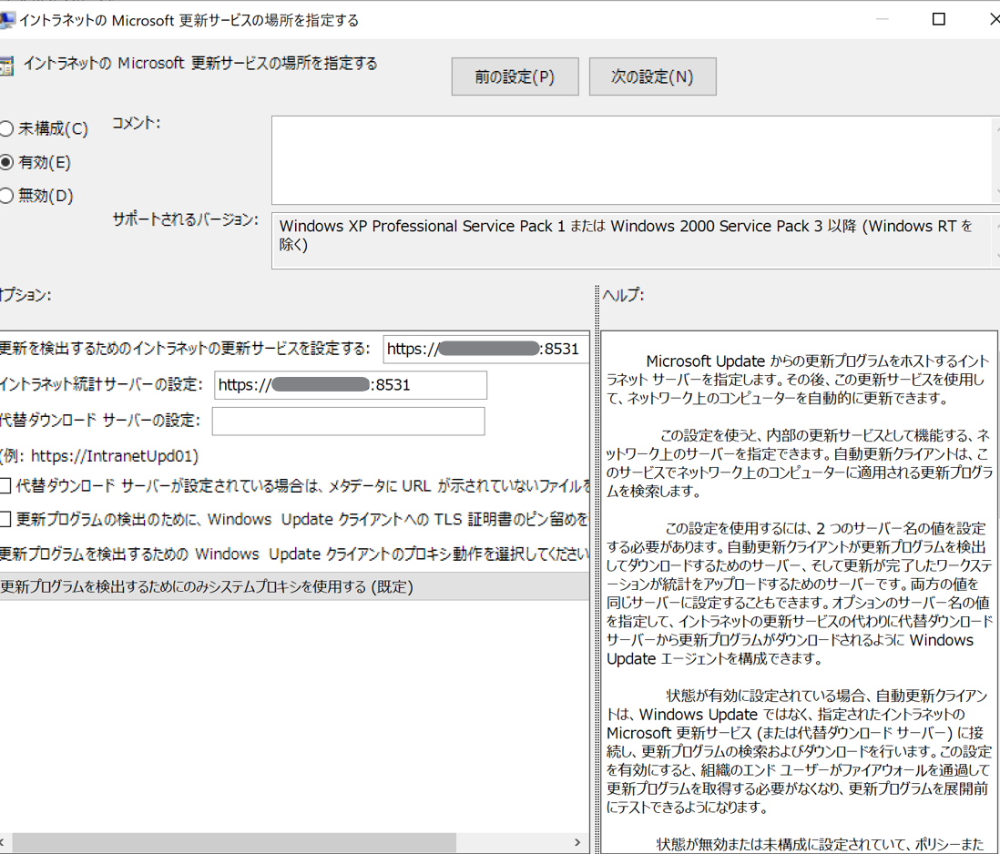

# HTTPS 構成の WSUS 環境構築マニュアル
みなさま、こんにちは。WSUS サポート チームです。今回は、HTTPS 構成 の WSUS 構築手順についてご紹介します。HTTPS 構成とすることをご検討いただく際に是非ご一読ください。

---

## HTTPS 構成の WSUS 環境構築手順  
- 手順  
a. サーバー証明書の準備
b. サーバー証明書のインポート  
c. サーバー証明書のバインド  
d. HTTPS の構成  
e. クライアントの参照する WSUS サーバーの設定 
f. クライアントのアクセス確認

### a. サーバー証明書準備
参考として、Active Directory 証明書サービスを利用して証明書を発行することができますのでご紹介します。
Active Directory 証明書サービスを利用して、エンタープライズ CA を構築し、テンプレートの複製を利用することで、Active Directory 配下のクライアントが証明書の発行要求を行うことができます。  

１．Active Directoryサーバーにて、役割と機能の追加から「Active Directory 証明書サービス」を追加します。  
[Active Directory Certificate Services をインストールするには](https://learn.microsoft.com/ja-jp/windows-server/networking/core-network-guide/cncg/server-certs/install-the-certification-authority#to-install-active-directory-certificate-services)  

２．Active Directoryサーバーにて、証明機関を開き、[証明書テンプレート]-[管理]より、[Webサーバー]を選択しテンプレートの複製を行います。  
３．Active Directoryサーバーにて、証明機関を開き、[証明書テンプレート]より、[新規作成]を選択し[発行する証明書テンプレート]から、２．で複製した [Webサーバー] のテンプレートを選択します。  
４．WSUS サーバーにて、証明書ストアを開き、[個人用]-[証明書] から、[すべてのタスク]―[新しい証明書の要求] を行い、３で作成した [Webサーバー] の証明書を要求します。


### b. サーバー証明書のインポート   
使用するサーバー証明書を個人用 証明書ストア にインポートします。  
1. WSUS サーバーで、インターネット インフォメーション サービス (IIS) マネージャを起動します。  
2. 左ペインより、サーバー名を選択します。  
3. 中央ペインより [サーバー証明書] を選択します。  
4. 右ペインより [インポート] を選択します。  
5. 証明書ファイルを選択後、パスワードを入力し、[OK] をクリックします。  
※　WSUS サーバーの 個人用 証明書ストアに使用する証明書が既に存在する場合はこの手順の実施は不要です。

### c. サーバー証明書のバインド  
インターネットインフォメーション サービス (IIS) にて、サーバー証明書をバインドします。  
1. インターネットインフォメーション サービス (IIS) マネージャより、[サイト] を展開し、 WSUS にて利用している Web サイト (既定 「 WSUS の管理」) を右クリックして、[バインドの編集] をクリックします。  
2. サイトバインドにて、8531 を選択し [編集] をクリックします。(カスタムポートをご利用の場合、ご利用の Web サイトより同様に サイトバインドにて 443 を選択します。)  
   
3.  [ SSL 証明書] にて、登録したサーバー証明書を選択し、[OK] をクリックします。  
4. [閉じる] をクリックして [サイト バインド] ダイアログ ボックスを終了します。  
   


### d. HTTPS の構成  
インターネットインフォメーション サービス ( IIS ) にて、 HTTPS を有効化します。  
1. インターネットインフォメーション サービス ( IIS ) マネージャより[サイト] を展開し、 WSUS にて利用している Webサイトを展開します。  
2. WSUS Web サイトの下にある APIRemoting30、ClientWebService、DSSAuthWebService、ServerSyncWebService および SimpleAuthWebService の各仮想ディレクトリで、次の手順を実行します。なお、一部の Web サービス で HTTP の通信を利用する仕様の為、Web サイト全体を HTTPS 構成にすることはできませんのでご留意ください。  
< 参考情報 > [2.3.2. 一部の接続に SSL を使用するように WSUS サーバーの IIS Web サーバーを構成する](https://learn.microsoft.com/ja-jp/windows-server/administration/windows-server-update-services/deploy/2-configure-wsus#232-configure-the-wsus-servers-iis-web-server-to-use-ssl-for-some-connections)  
2-1. [機能ビュー] で [ SSL 設定] をダブルクリックします。  
2-2. [ SSL 設定] ページで、[ SSL が必要] を選択します。  
2-3. [操作] ウィンドウで、[適用] をクリックします。  
   

3. インターネットインフォメーション サービス ( IIS ) マネージャを閉じます。
4. コマンドプロンプトを管理者権限で立ち上げ 「C:\Program Files\Update Services\Tools」 フォルダに移動します。
```  
 cd C:\Program Files\Update Services\Tools
```  
次のコマンドを実行します。  
```  
WSUSUtil.exe configuressl < WSUS サーバーの FQDN>  
```  
 
### e. クライアントの参照する WSUS サーバーの設定
上述の a,b,c の手順にて、WSUS サーバーの HTTPS を有効化した後、クライアントが WSUS との通信において HTTPS を利用できるように構成します。下記ポリシーにて、WSUS サーバーの通信プロトコル及びポート番号をご指定ください。  

・ポリシー  
[コンピューターの構成] - [管理用テンプレート] - [Windows コンポーネント] - [Windows Update] - [イントラネットの Microsoft 更新サービスの場所を指定する]  
または  
[コンピューターの構成] - [管理用テンプレート] - [Windows コンポーネント] - [Windows Update] - [Windows Server Update Service から提供される更新プログラムの管理] - [イントラネットの Microsoft 更新サービスの場所を指定する]  

``` 
例　https://< WSUS サーバーのFQDN >:8531 
``` 
   

### f. クライアントのアクセス確認  
クライアントが HTTPS で WSUS サーバーへ通信を行えることを確認します。  
[設定]-[Windows Update]-[更新プログラムのチェック]ボタンを押下して検出処理が完了できることをご確認ください。