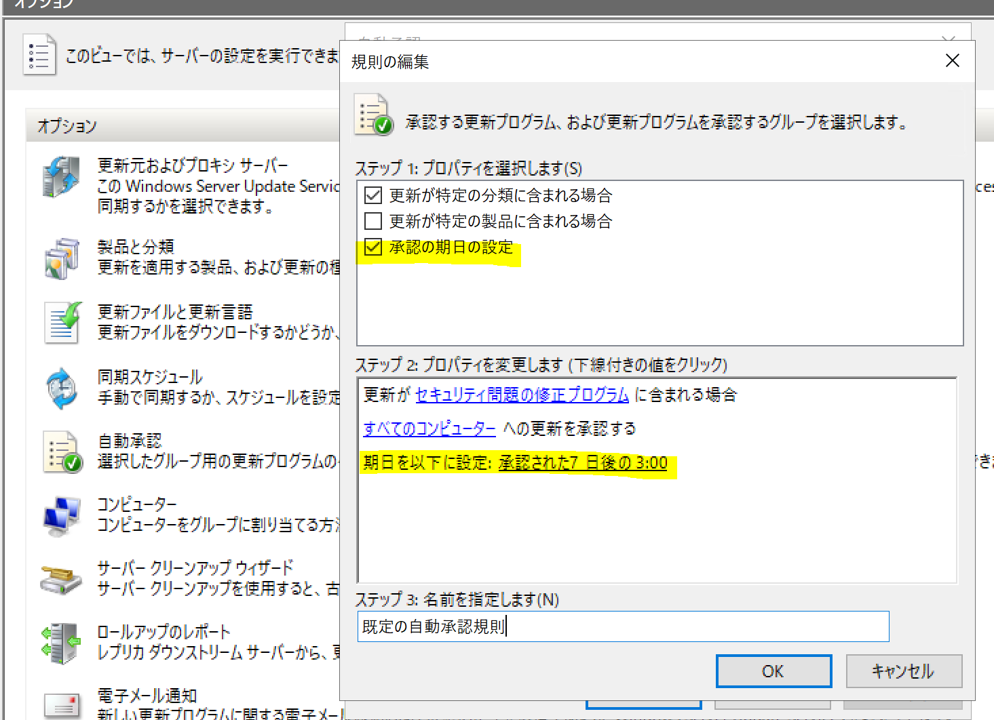

# 自動承認規則の "承認の期日の設定" について
みなさま、こんにちは。WSUS サポート チームです。今回は、自動承認規則の "承認の期日" の設定について紹介いたします。  

---

## "承認の期日の設定" とは  
"承認の期日の設定" とは、自動承認規則で利用することのできる期日の設定です。  

まず自動承認規則では、同期されたタイミングで自動承認規則にて設定した条件を満たした更新プログラムが対象のコンピュータグループへ承認されます。自動承認規則の規則設定項目の一つに "承認の期日の設定" があります。  

こちらの "承認の期日の設定" につきましては、設定した期日が到来しその日時までに対象となる更新プログラムのインストール処理が完了していない場合に強制的なインストールを行わせる設定です。上記画面ショットの例では、自動承認が行われた後 7 日後の 3:00 までにインストールが完了していないクライアントは、強制的なインストールが実行されます。クライアントへ承認を実施する日時を設定するものではございませんのでご留意ください。  

参考：自動承認規則については以下の記事を参照ください。  
[Configuration Manager の自動展開規則と WSUS の自動承認規則について](https://jpmem.github.io/blog/mecm/20220426_01/)   
[3.2. 自動承認規則を構成する](https://learn.microsoft.com/ja-jp/windows-server/administration/windows-server-update-services/deploy/3-approve-and-deploy-updates-in-wsus#32-configure-auto-approval-rules)   
