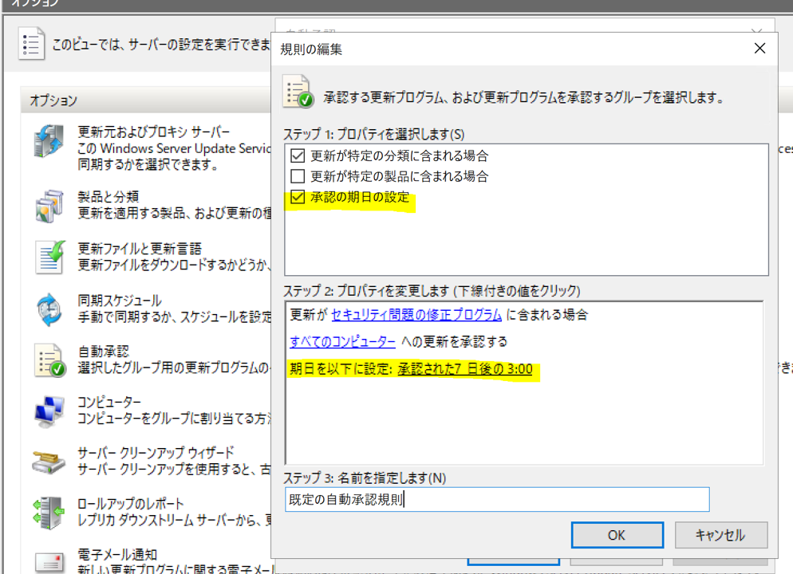

# 自動承認規則の "承認の期日の設定" について
みなさま、こんにちは。WSUS サポート チームです。今回は、自動承認規則の "承認の期日" の設定について紹介いたします。 字面からは一見勘違いしやすい設定ですが、下記に記載の通りの動作となりますのでご留意いただければと存じます。

---

## "承認の期日の設定" とは  
"承認の期日の設定" とは、自動承認規則で利用することのできる期日の設定です。  
参考：自動承認規則については以下の記事を参照ください。  
- [Configuration Manager の自動展開規則と WSUS の自動承認規則について](https://jpmem.github.io/blog/mecm/20220426_01/)   
- [3.2. 自動承認規則を構成する](https://learn.microsoft.com/ja-jp/windows-server/administration/windows-server-update-services/deploy/3-approve-and-deploy-updates-in-wsus#32-configure-auto-approval-rules)   

自動承認規則を事前に設定していると、上位サーバー（ Microsoft Update サイトや非レプリカ環境のアップストリームサーバー ）と同期したタイミングで、自動承認規則で事前設定した条件を満たした更新プログラムが、事前設定したコンピューターグループに承認されます。  
この自動承認規則で設定出来る項目の一つに "承認の期日の設定" があります。  

  

"承認の期日の設定" で期日を指定すると、この期日までに更新プログラムのインストールが終わっていない端末に対して強制的に更新プログラムのインストールを行わせることができます。  
上記画面ショットの例では、自動承認により、更新プログラムの同期が完了し、コンピューターグループに対する承認が行われた、その日時から7日後の 3:00 までに、対象のコンピューターグループに所属していながら、更新プログラムのインストールが完了していないクライアントは、強制的にインストールが実行されます。  

字面からは、コンピューターグループに対する自動承認を行う設定のように一見読み取れますが、そうではなく、上記でも述べました通り、自動展開規則の承認後に、インストールを強制する日付ですのでご留意ください。  

