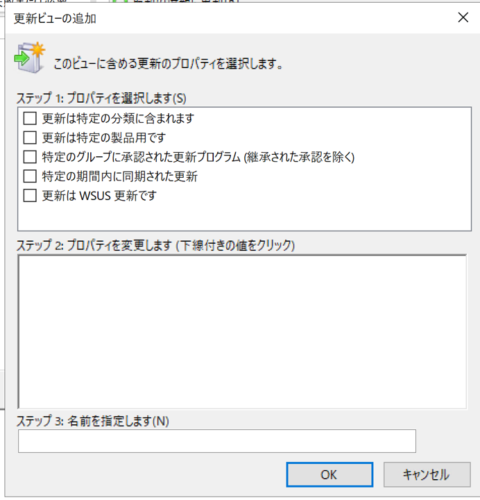
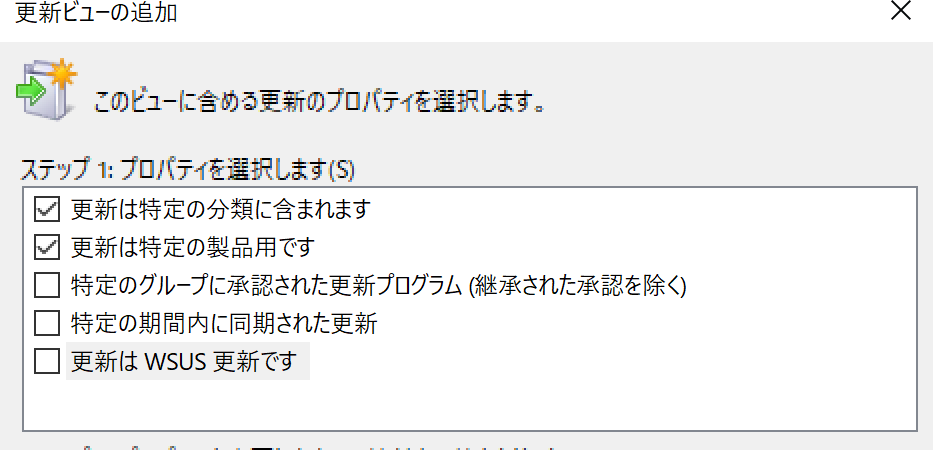
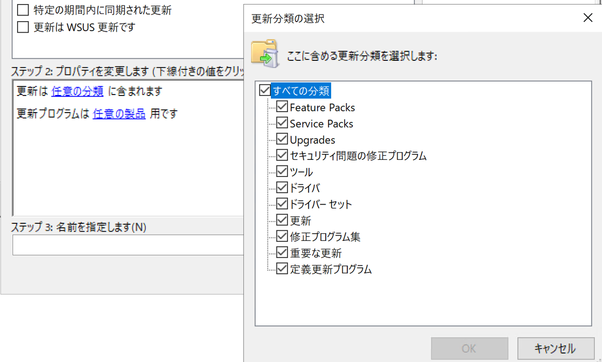
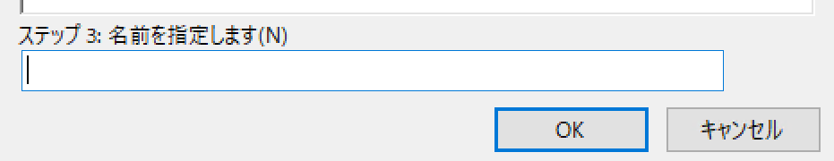

# 更新ビューの作成方法  
みなさま、こんにちは。WSUS サポート チームです。今回は、更新ビューの作成方法について紹介いたします。更新ビューを作成いただくことにより、WSUS メンテナンスや承認作業等を効率的に行うことができますので是非ご活用ください。  

---

# 更新ビューについて  
更新ビューは、WSUS コンソール上で、必要な更新プログラムをフィルタリングして表示する機能です。以下に WSUS で新しい更新ビューを作成する手順をご紹介します。  

# 作成方法  
1.  WSUS 管理コンソールの左ペインで、 [更新プログラム] を展開し、 [すべての更新プログラム] を選択します。  
2. 右クリックで、 [新しい更新ビュー] を選択すると、更新ビューの追加ウィンドウが開きます。  
 

3. 更新ビューの追加ウィンドウにて、必要なプロパティや値を選択し更新ビューを作成します。  
   ### ステップ１：プロパティを選択します。 
     
    - [更新は特定の分類に含まれます]：分類 でフィルタリングする場合にチェックを入れます。  
    - [更新は特定の製品用です]：製品 でフィルタリングする場合にチェックを入れます。  
    - [更新は特定のグループに対して承認済みです]：承認先のコンピューターグループ でフィルタリングする場合にチェックを入れます。  
    - [特定の期間内に同期された更新]：特定の期間に同期された更新プログラムでフィルタリングする場合にチェックを入れます。  
    - [更新は WSUS 更新です]：こちらは現在既に廃止されている機能である為選択不要です。
 
   ### ステップ２: プロパティを変更します　(下線付きの値をクリック)  
   上記で選択したプロパティに従って値を変更ください。
  
   ### ステップ３: 名前を指定します　(N)  
   作成した更新ビューに任意の名前を付け [OK] を選択します。 
  

上記手順により、新しい更新ビューが作成され更新ビューが追加されます。これらの更新ビューを利用いただくことで、特定の製品、分類、コンピュータグループへの承認状態、同期期間などに基づいて更新プログラムを効率的に管理できますので運用管理にお役立てください。  

参考：[更新プログラムを表示および管理する]([https://learn.microsoft.com/ja-jp/windows-server/administration/windows-server-update-services/manage/viewing-and-managing-updates)