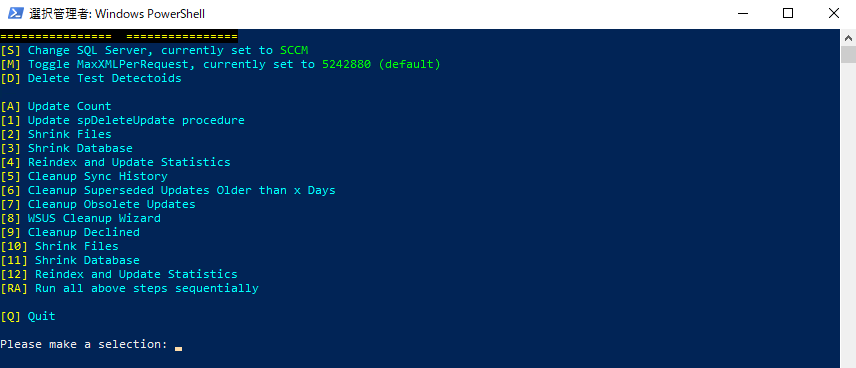

# WSUS データベース メンテナンス スクリプトのご紹介

みなさま、こんにちは。Configuration Manager / WSUS サポート チームです。

WSUS データベース (SUSDB) の定期的なメンテナンスは、WSUS の健全性とパフォーマンスを維持するために重要です。しかし、不要な更新プログラムの削除、データベースの圧縮、インデックスの再構築などを個別に実行するのは、手間がかかります。

Microsoft Learn の以下の記事では、これらの作業をまとめて実行できる PowerShell スクリプトを公開しています。

- [Manual and automatic WSUS database maintenance](https://learn.microsoft.com/en-us/troubleshoot/mem/configmgr/update-management/wsus-automatic-maintenance#maintain-the-wsus-database-susdb-automatically)

今回は、この `SUSDB-Maintenance` スクリプトの実行方法と、メニューの各選択肢で行われる処理をご紹介します。

## スクリプトの特長

このスクリプトには、以下の特長があります。

- SUSDB の更新プログラム数の確認、クリーンアップ、圧縮、インデックスの再構築などを、1 つのメニューから実行できます。
- `[RA]` を選択すると、一連のメンテナンスを順番に実行できます。
- Windows Internal Database (WID) と SQL Server の両方に対応しています。SQL Server が別のサーバーにある場合は、メニューから接続先を変更できます。
- SQL Server PowerShell モジュールは不要で、.NET の `SqlClient` を使用して SUSDB に接続します。
- 実行結果や各処理の所要時間は、スクリプトを実行したフォルダーの `SUSDB-Maintenance.log` に記録されます。

## 実行前の注意事項

スクリプトを実行する前に、以下をご確認ください。

- Configuration Manager のソフトウェア更新ポイント、またはスタンドアロン WSUS で設定している定期同期を無効にし、メンテナンス中に同期が実行されないようにします。
- 事前に SUSDB をバックアップします。バックアップ方法は、[WSUS データベースのバックアップ方法について](https://jpmem.github.io/memlog/wsus/backup/backup.html) をご参照ください。
- スクリプトは WSUS サーバー上の Windows PowerShell を管理者として起動して実行します。WSUS 管理コンソールも同じサーバーにインストールされている必要があります。
- WID は WSUS サーバー上にあるローカルの WID が対象です。リモートの SQL Server を使用している場合は、実行後に `[S]` で接続先を指定します。
- WSUS を階層構成にしている場合は、階層内の各 WSUS サーバーで実行します。クリーンアップや削除を行う場合は、下位の WSUS サーバーから開始します。
- メンテナンスではデータベースやディスクへの負荷が高くなる場合があります。業務への影響が少ない時間帯に、十分な作業時間を確保して実行してください。

> [!NOTE]
> 公開されているスクリプトはサンプルであり、現状有姿で提供されています。Microsoft の標準サポート プログラムまたはサービスによるサポート対象ではありません。注意事項と免責事項を公開ページで確認し、事前に検証したうえでご利用ください。

## スクリプトの入手と実行

1. [Microsoft Learn の公開ページ](https://learn.microsoft.com/en-us/troubleshoot/mem/configmgr/update-management/wsus-automatic-maintenance#maintain-the-wsus-database-susdb-automatically)を開き、PowerShell のコード ブロックをコピーします。
1. コピーした内容を、WSUS サーバー上に `SUSDB-Maintenance.ps1` などの名前で保存します。
1. Windows PowerShell を管理者として起動し、スクリプトを保存したフォルダーへ移動して実行します。

```powershell
cd C:\Temp
.\SUSDB-Maintenance.ps1
```

スクリプトは、WSUS のレジストリ設定から WID または SQL Server の接続先を判定します。起動すると `SUSDB-Maintenance.log` が作成され、以下のメニューが表示されます。



## 各選択肢で行われる処理

| 選択肢 | メニュー表示 | 行われる処理 |
| --- | --- | --- |
| `[S]` | Change SQL Server | SUSDB への接続先を変更します。リモートの SQL Server を使用している場合などに、SQL Server 名またはインスタンス名を入力します。 |
| `[M]` | Toggle MaxXMLPerRequest | SUSDB の `MaxXMLPerRequest` を `0` と既定値の `5242880` の間で切り替えます。既定以外の値が設定されている場合は、変更する値を選択できます。変更を反映するには、スクリプト終了後に IIS の再起動が必要です。 |
| `[D]` | Delete Test Detectoids | 2026 年 7 月の WSUS 同期問題に関連するテスト用の検出データを検索し、参照されていないデータを削除します。参照中のデータはスキップされます。削除が行われた場合は、スクリプト終了後に IIS の再起動が必要です。 |
| `[A]` | Update Count | 更新プログラムの総数、有効な更新プログラム、置き換え済み、拒否済み、クリーンアップが必要な不要な更新プログラムなどの件数を取得し、ログへ記録します。メンテナンス前後の比較に使用できます。 |
| `[1]` | Update spDeleteUpdate procedure | 不要な更新プログラムを削除するストアド プロシージャ `spDeleteUpdate` を、削除処理のパフォーマンスを改善した実装に更新します。([The spDeleteUpdate stored procedure runs slowly](https://learn.microsoft.com/en-us/troubleshoot/mem/configmgr/update-management/spdeleteupdate-slow-performance) に記載の SQL を実行します。) |
| `[2]` | Shrink Files | `DBCC SHRINKFILE` を実行して SUSDB のデータ ファイルを圧縮し、未使用領域を解放します。処理前後のファイル サイズもログへ記録します。 |
| `[3]` | Shrink Database | `DBCC SHRINKDATABASE` を実行して SUSDB を圧縮し、データベース ファイル内の未使用領域を解放します。 |
| `[4]` | Reindex and Update Statistics | SUSDB の全テーブルのインデックスを再構築した後、列の統計情報を `FULLSCAN` で更新します。 |
| `[5]` | Cleanup Sync History | SUSDB の `tbEventInstance` から、同期履歴に使用されるイベント レコードを削除します。 |
| `[6]` | Cleanup Superseded Updates Older than x Days | 入力した日数より古い、置き換え済みで未拒否の更新プログラムを「拒否済み」に設定します。入力できる値は 1 ～ 99 日です。Configuration Manager を使用している場合は、ソフトウェア更新ポイントの置き換え規則と同じ日数を指定します。 |
| `[7]` | Cleanup Obsolete Updates | `spGetObsoleteUpdatesToCleanup` で不要な更新プログラムを取得し、`spDeleteUpdate` を使用して 1 件ずつ SUSDB から削除します。 |
| `[8]` | WSUS Cleanup Wizard | WSUS 管理 API を使用してクリーンアップ ウィザードを実行します。置き換え済みおよび期限切れの更新プログラムの拒否、不要な更新プログラムとリビジョン、古いコンピューター、不要なコンテンツ ファイルの削除を行います。 |
| `[9]` | Cleanup Declined | WSUS 管理 API を使用して、拒否済みの更新プログラムを削除します。ほかの更新プログラムから参照されていて削除できないものはスキップし、ログへ記録します。 |
| `[10]` | Shrink Files | `[2]` と同じ処理です。更新プログラムの削除後に、SUSDB のデータ ファイルを再度圧縮します。 |
| `[11]` | Shrink Database | `[3]` と同じ処理です。更新プログラムの削除後に、SUSDB を再度圧縮します。 |
| `[12]` | Reindex and Update Statistics | `[4]` と同じ処理です。クリーンアップと圧縮によって断片化したインデックスを再構築し、統計情報を更新します。 |
| `[RA]` | Run all above steps sequentially | 保持日数を入力した後、更新プログラム数の確認、テスト用検出データの削除、`[1]` ～ `[12]`、更新プログラム数の再確認を順番に実行します。`[S]` と `[M]` は実行されません。 |
| `[Q]` | Quit | スクリプトを終了します。 |

## `[RA]` で一括実行する場合

`[RA]` を選択すると、最初に置き換え済み更新プログラムを保持する日数の入力を求められます。1 ～ 99 日の範囲で入力すると、以下の順番で処理が実行されます。

```text
[A] → [D] → [1] → [2] → [3] → [4] → [5] → [6] → [7] → [8] → [9] → [10] → [11] → [12] → [A]
```

`[S]` と `[M]` は一括実行に含まれません。リモートの SQL Server へ接続する場合は、先に `[S]` で接続先を変更してください。また、`[M]` で設定を変更した場合や `[D]` でデータが削除された場合は、すべての処理が完了してから、計画したメンテナンス時間内に IIS を再起動してください。

## 実行時間と結果の確認

実行時間は、サーバーの CPU、メモリ、ディスク性能、前回のメンテナンスからの経過期間、同期対象の製品と分類、クリーンアップ対象の件数によって大きく異なります。定期的にメンテナンスしている小規模な環境では `[RA]` が 1 分未満で完了することもありますが、メンテナンスを長期間実施していない環境では、数日かかる場合があります。

処理の完了後は、`SUSDB-Maintenance.log` でエラー、各処理の所要時間、削除件数、圧縮前後のファイル サイズを確認します。`[A]` の結果も比較し、拒否済みまたは不要な更新プログラムの件数が減少していることをご確認ください。

拒否済みの更新プログラムが多い場合は、公開情報の手順に従い、`[9]` ～ `[12]` を複数回実行してから `[A]` で件数を確認します。一度に完了させようとせず、ログと件数を確認しながら段階的に進めてください。

## 関連情報

- [The complete guide to WSUS and Configuration Manager SUP maintenance](https://learn.microsoft.com/en-us/troubleshoot/mem/configmgr/update-management/wsus-maintenance-guide)
- [WSUS メンテナンスガイド新版](https://jpmem.github.io/blog/wsus/2022-05-09_01/)
- [WSUS DB インデックスの再構成の手順について](https://jpmem.github.io/blog/wsus/2014-03-05_01/)
- [SUSDB.mdf が肥大化したときの対処方法について](https://jpmem.github.io/blog/wsus/2020-03-27_01/)